W nowym Windows Server 2012 spotkała mnie mała niespodzianka. Po wpisaniu dotychczas używanej komendy "dcpromo" zostaje wyświetlona informacja o tym, że instalacja roli AD DS została przeniesiona w inne miejsce w Server Manager-a.

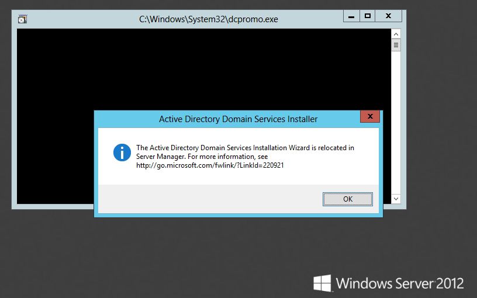

<!--truncate-->

Instalacja

Przechodzimy więc do Server Manager-a i wybieramy opcję "Add roles and features":

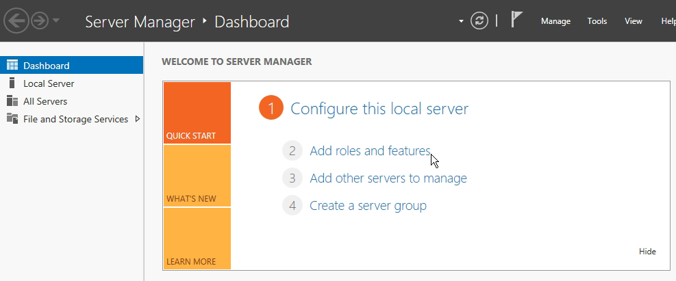

Kolejno przechodzimy przez dwa okienka, które nie mają większego znaczenia dla naszej konfiguracji:

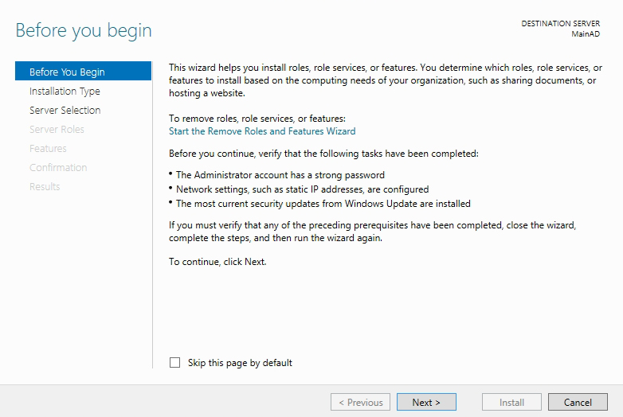

Jak widzimy w nowym Windows Server 2012 mamy opcję wyboru serwera, na którym chcielibyśmy zainstalować usługi. Jest to bardzo interesujące rozwiązanie dla rozwiniętej firmy, ponieważ możemy używać jednego głównego serwera, z którego będziemy instalować i konfigurować wszystkie usługi. W moim przypadku jest to pierwszy serwer, dlatego nie mamy zbyt dużego wyboru:

Z listy dostępnych ról wybieramy "Active Directory Domain Services":

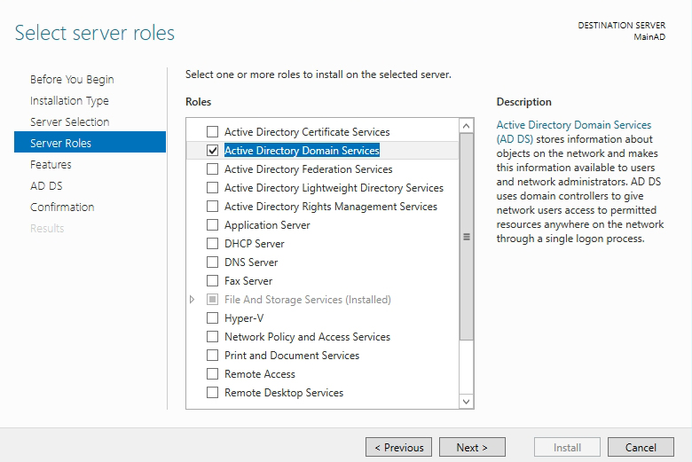

Po zaznaczeniu AD DS wyskoczy okienko z informacją o doinstalowaniu dodatkowych potrzebnych ról (potwierdzamy je):

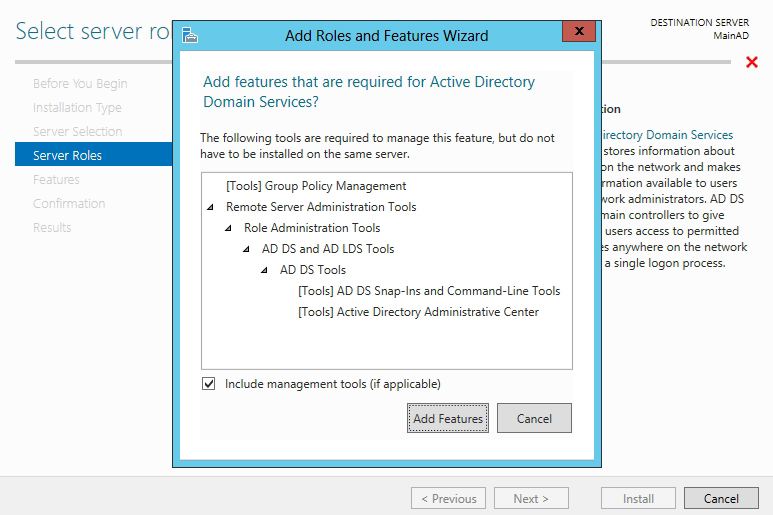

W kolejnych krokach klikamy NEXT, aż do podsumowania konfiguracji:

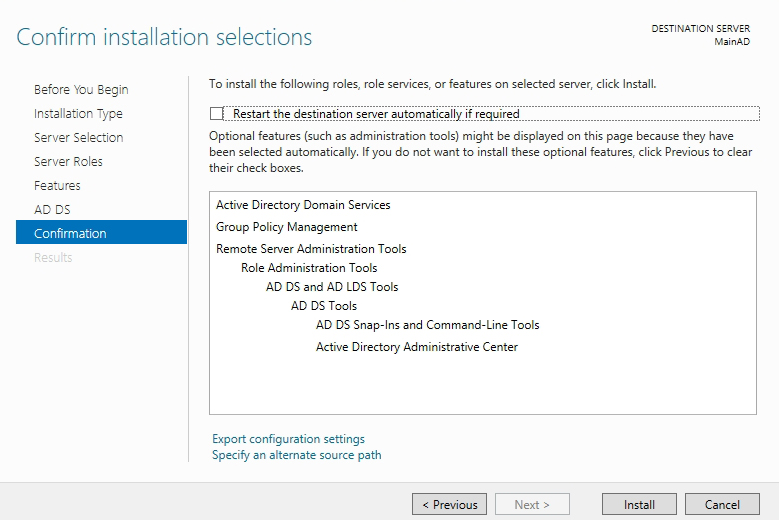

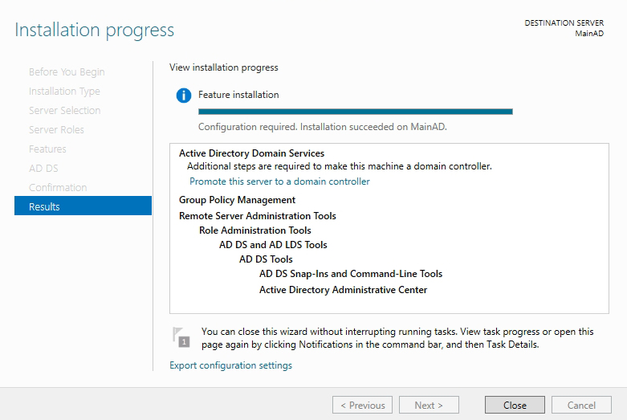

Po udanej instalacji należy ponownie uruchomić komputer.

Konfiguracja

Po instalacji przechodzimy do Server Manager-a, wybierając po lewej stronie AD DS. Następnie klikamy na link "More...", który znajduje się na żółtym pasku:

Otworzy nam się nowe okienko, w którym należy wybrać "Promote this server to a domain...":

Następne okna dotyczą ściśle tworzenia domeny, tak jak było to w poprzednich systemach Windows Server. W moim przypadku jest tworzona nowa domena, dlatego na początek wpisujemy nazwę tworzonej domeny:

W kolejnym etapie wybieramy właściwości domeny. Może ona współpracować ze starszymi kontrolerami domen (od AD w Windows Server 2003). Poniżej wprowadzamy hasło dostępowe:

Warto zauważyć, że instalacja Active Directory wykryła brak usługi DNS na naszym serwerze, dlatego zostanie automatycznie doinstalowana:

W kolejnym kroku potwierdzamy i klikamy NEXT:

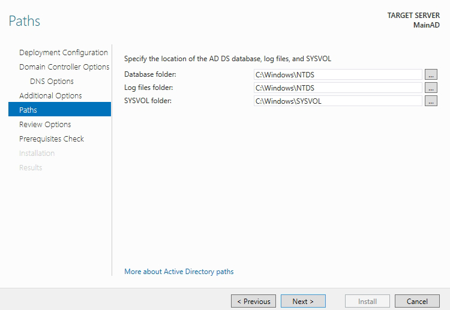

Kolejne dwa kroki przedstawiają podsumowanie i konfigurowanie usługi Active Directory Domain Services wraz z usługą DNS:

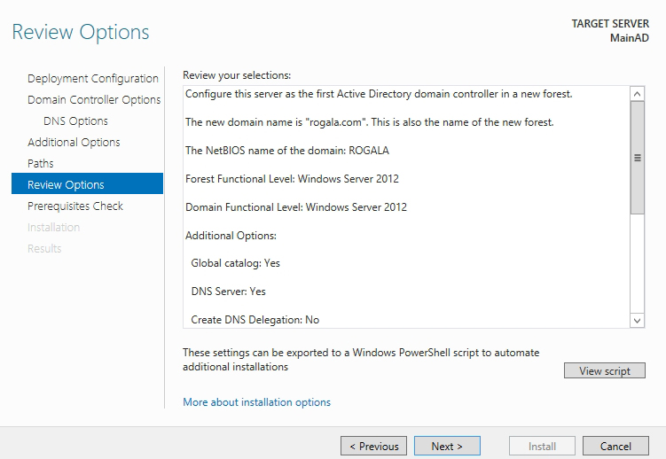

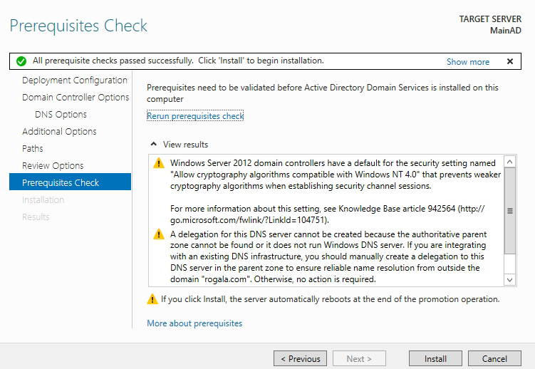

Potwierdzamy lub czekamy na ponowne uruchomienie:

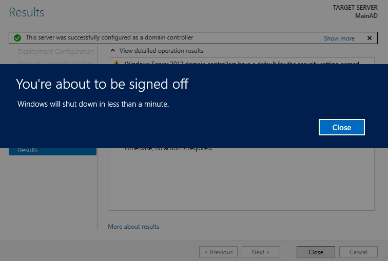

W tym momencie została poprawnie skonfigurowana nasza domena. W kolejnym kroku przedstawię jeszcze dodawanie nowego użytkownika i grupy.

Dodawanie użytkownika i grupy

W Windows Server 2012 wygląd AD DS został nieco zmieniony ze względu na integrację panelu z PowerShell-em. Myślę, że to bardzo dobry krok w przód, ponieważ wszystko, co robimy (klikamy), możemy podejrzeć, naciskając na dole okna przycisk "Windows PowerShell History". Umożliwi to nam gromadzenie w formie skryptowej naszych działań i późniejsze wykonywanie pracy poprzez zwykłe wklejanie poleceń w PowerShell. Na początku wybierzmy "Active Directory Administrative Center" ze Startu:

Łatwo zauważyć, że okno "Active Directory Administrative Center" jest przejrzyste i czytelne:

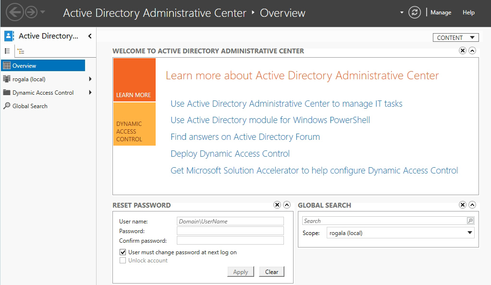

Przechodzimy do naszej domeny po lewej stronie. Z listy możemy wybrać "User", kliknąć prawym przyciskiem myszy i wybrać nowego użytkownika lub grupę:

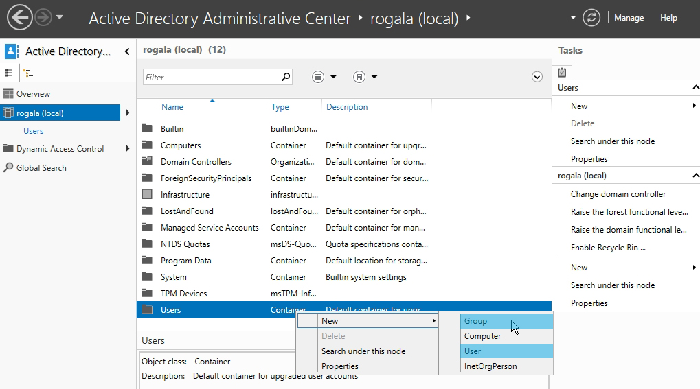

Samo dodawanie użytkownika i grupy nie zmieniło się szczególnie poza wyglądem okna:

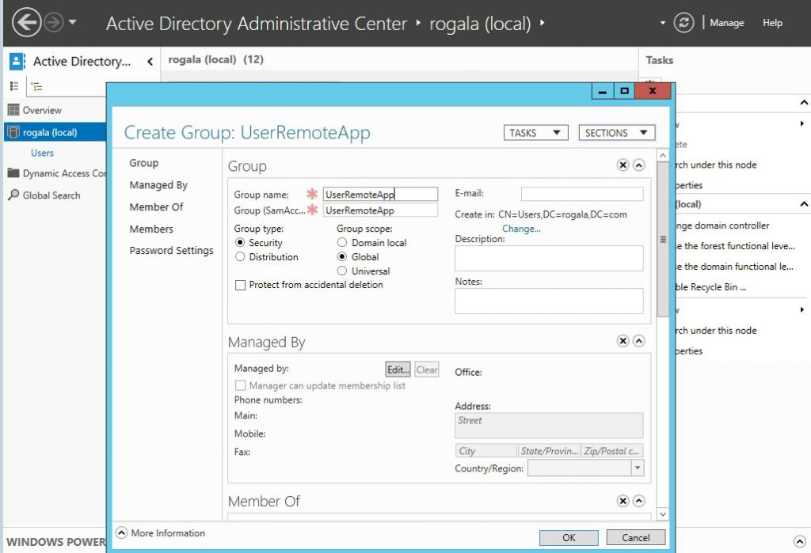

Na końcu możemy zobaczyć, jak to wszystko wygląda od strony PowerShell-a, o którym wspomniałem na początku. Na screenie przedstawione jest usunięcie i dodanie ponownie tej samej grupy dla użytkowników:

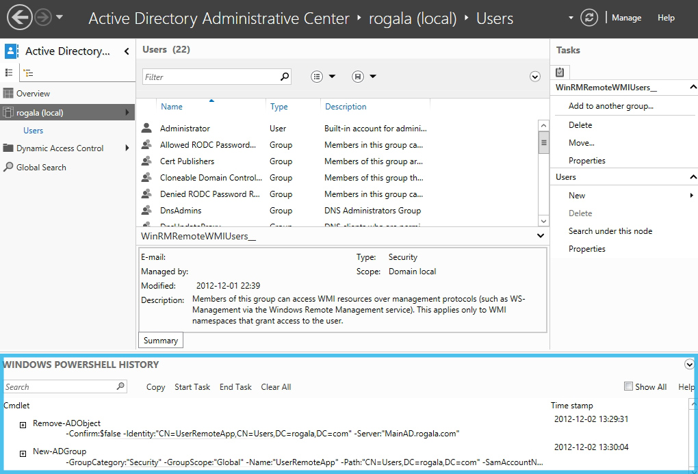

Wklejając te polecenia do PowerShell-a, zrobimy to samo bez konieczności wchodzenia do panelu AD. Dzięki takiemu rozwiązaniu możemy ćwiczyć pisanie poleceń do PowerShell-a :).