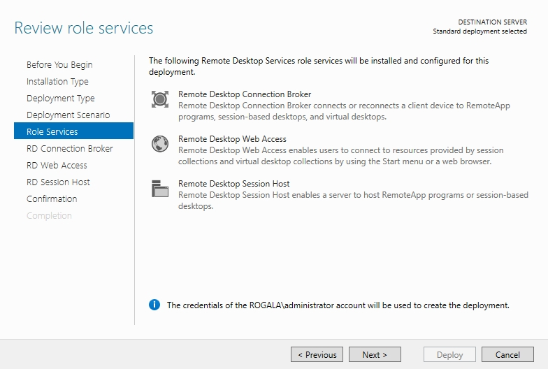
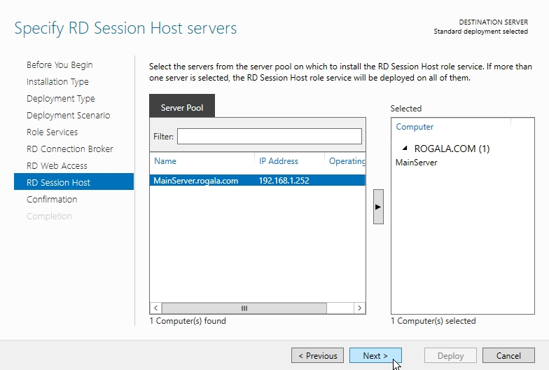
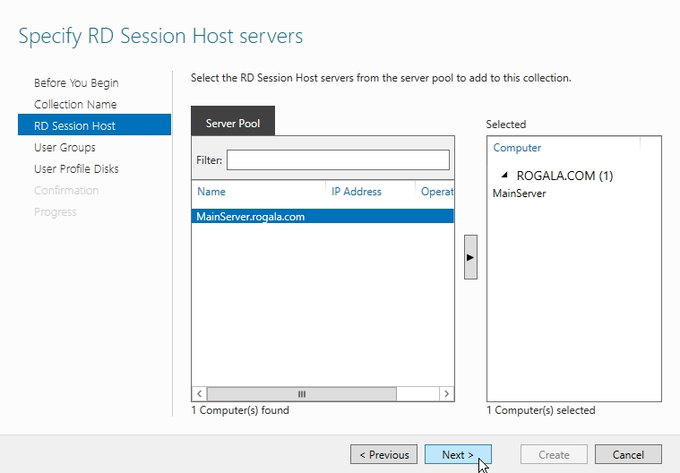
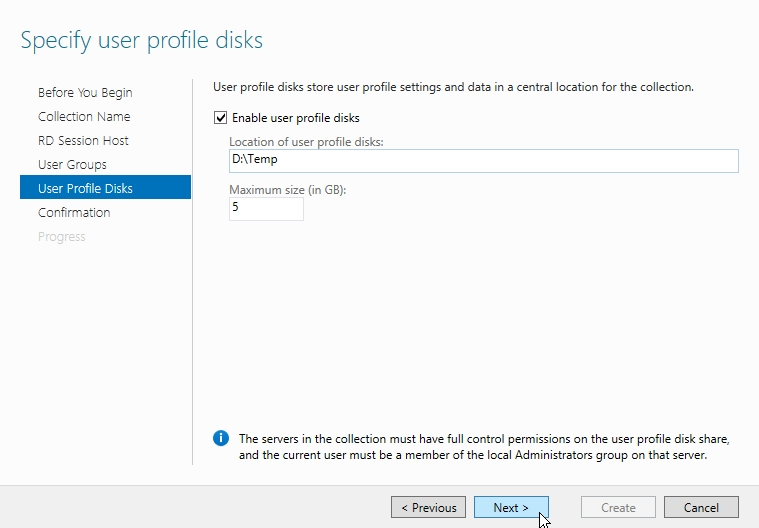
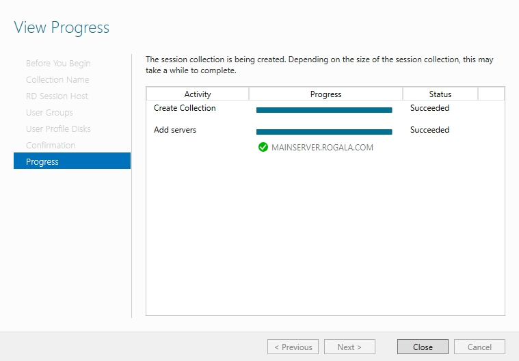
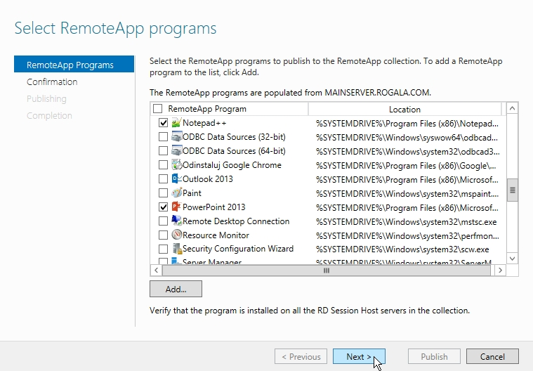

Dzisiaj przedstawię, jak należy poprawnie udostępnić zdalne aplikacje w Windows Server 2012. Udostępnianie wirtualnych maszyn i zdalnych aplikacji zostało rozbudowane, dlatego warto zapoznać się z wstępną konfiguracją. Na początku, jak zawsze, rozpoczynamy w Server Manager i dodajemy nową rolę, a następnie w tym momencie użyjemy nowych udogodnień do tworzenia zdalnych usług. Wybieramy opcję "Role Desktop Services installation", a w kolejnym kroku wybieramy: "Standard deployment".

<!--truncate-->

Przy tym kroku musimy się trochę bardziej zastanowić nad tym, co będziemy chcieli udostępniać. W moim przypadku przedstawię scenariusz dla udostępniania samych zdalnych aplikacji (RemoteApp). Jeśli chcielibyśmy udostępniać wirtualne środowiska i zdalne aplikacje, należałoby wybrać opcję: "Virtual machine-based desktop deployment". W naszym przypadku wybieramy "Session-based desktop deployment" i klikamy dwa razy NEXT:

W tym momencie możemy wybrać serwer, na którym zainstalujemy usługę RD Connection Broker. Jeśli będziemy mieli połączenie z innymi serwerami w sieci, będziemy mogli go wybrać z listy po lewej stronie bez konieczności logowania się do tamtego serwera. Ze względu na to, że konfiguruję to na jednym serwerze, w każdym momencie wybieram ten sam serwer. Przy okazji, zaleca się mieć RD Connection Broker na osobnym serwerze ze względu na rozładowanie zapytań do serwera. W kolejnych krokach wybieramy serwery dla RD Web Access i RD Session Host:

Potwierdzamy cały proces konfiguracji i instalujemy nasze nowe usługi na serwerze. Wszystko powinno się zakończyć w taki sposób, jak poniżej:

Po udanym restarcie naszego serwera możemy przystąpić do publikacji zdalnych aplikacji. Przechodzimy do Server Manager'a i wybieramy pozycję Remote Desktop Service z lewej strony. Po obejrzeniu panelu, jaki zostanie nam wyświetlony, możemy wybrać pozycję "Create session collections":

W nowym oknie dokonujemy konfiguracji kolekcji w jakiej zostaną utworzone zdalne aplikacje. Możemy wybrać dowolną nazwę kolekcji:

W kolejnym kroku wybieramy serwer, który będzie źródłem udostępniania zdalnych aplikacji:

Wybieramy grupę użytkowników, którzy otrzymają dostęp do aplikacji. Domyślnie jest to "Domain Users", możemy oczywiście zmienić na dowolną inną grupę:

Możemy dodatkowo określić przestrzeń na dysku dla aplikacji, aby użytkownicy mieli wspólne miejsce do przetrzymywania plików (tego jeszcze dokładnie nie sprawdziłem, mam nadzieję, że nie podaję błędnych informacji). Po określeniu ilości miejsca dla tego folderu przechodzimy do podsumowania i konfigurowania kolekcji:

Gdy zostanie utworzona kolekcja, przechodzimy do niej w panelu "Remote Desktop Session > Collections > RemoteApp", wybieramy opcję "Publish RemoteApp Programs":

Kolejne kroki przypominają konfigurację z poprzedniego Windows Server 2008. Wybieramy aplikację, która ma zostać publikowana. Następnie klikamy NEXT, aż do podsumowania konfiguracji:

Aby sprawdzić, czy działają nasze udostępnione aplikacje, należy wejść na stronę: https://nazwa_serwera.domena/rdweb. Ciekawostką, jaką zauważyłem, jest możliwość uruchomienia strony Web Access z innych przeglądarek niż IE. Gdy konfigurowałem zdalne aplikacje pod Windows Server 2008 R2, Web Access nie działało pod Chrome/Firefox itd., a w WS 2012, jak widać na Chrome, zadziałał bez problemu 😊:

