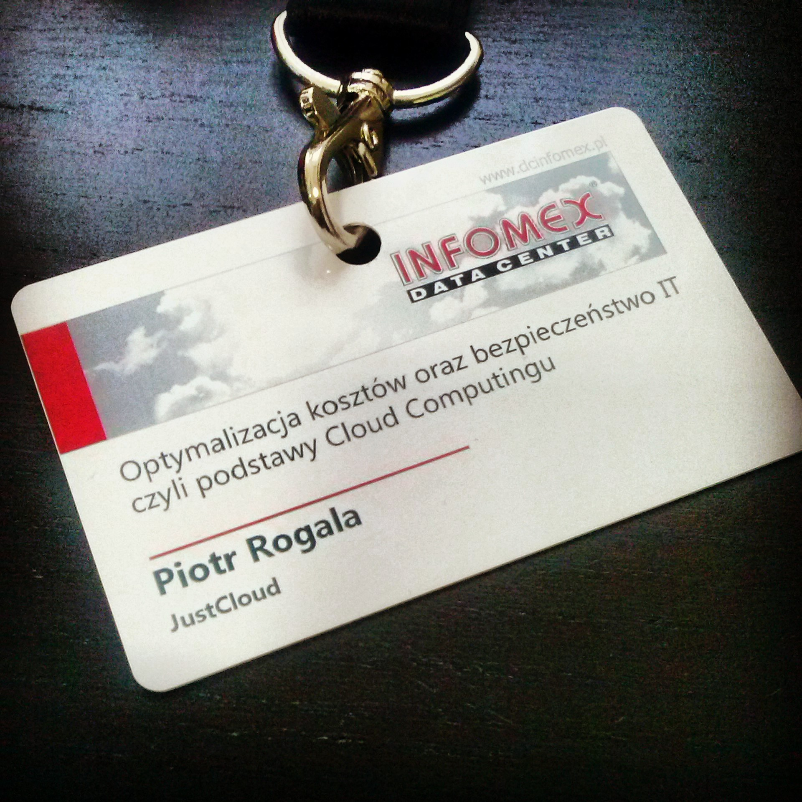

 
Kilka dni temu miałem okazję uczestniczyć na spotkaniu firmy Infomex, która jest dostawcą nowoczesnego Data Center. Na spotkanie poszedłem zupełnie bez wiedzy, co na nim się odbędzie. Początkowo wydawało mi się, że będzie to jakaś normalna konferencja, na której będzie kilka firm, które będą omawiać definicję Cloud z wikipedii. I w tym momencie się jednak rozczarowałem. Na miejscu okazało się, że jest to prezentacja firmy. Przedstawiciel Infomex-u był osobą, która ma wiedzę co rzadko się zdarza na takich prezentacjach ;). Muszę przyznać, że poruszono dużo tematów związanych z cloud-ami i serwerowniami "Data Center". Wszystkie poruszane kwestie były poparte doświadczeniami firmy, co bardzo mi się podobało i przedstawiło firmę za wiarygodną i rzetelną. W tej chwili Infomex oferuje wirtualną moc obliczeniową na życzenie, oczywiście dzisiaj to nie nowość. Dodam, że minusem firmy jest brak panelu do zarządzania wirtualną infrastrukturą. Podsumowując ten krótki post, będąc na tym kilku godzinnym spotkaniu dowiedzieliśmy się, co możemy, a dokładniej gdzie możemy skorzystać z usług Data Center szytą na miarę. Będąc klientem możemy dostać fizyczny dostęp do serwerowni oraz mieć kontrolę gdzie fizycznie znajduje się nasza wirtualna infrastruktura.
