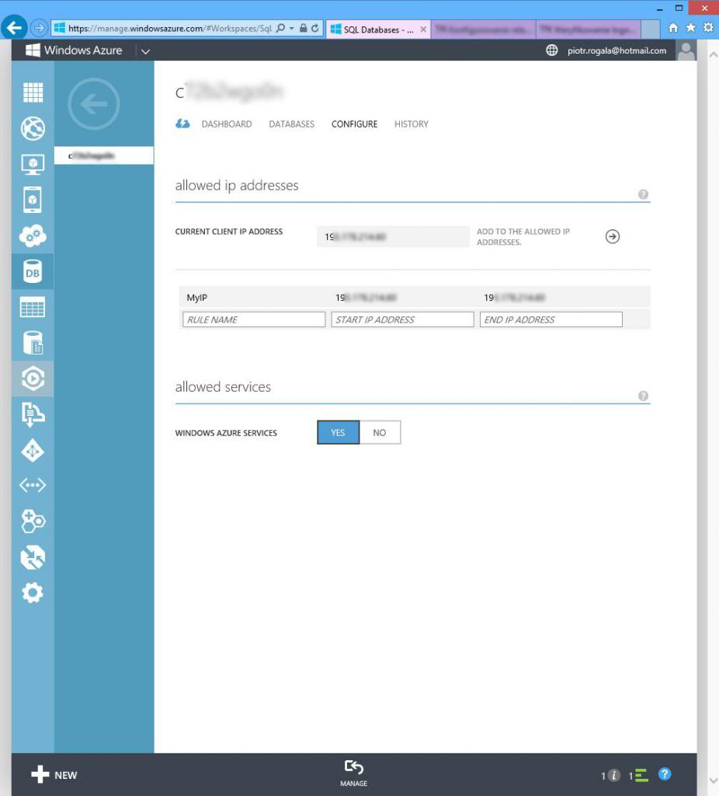
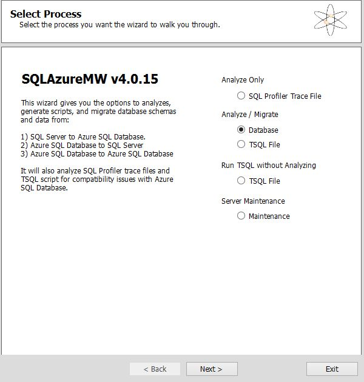
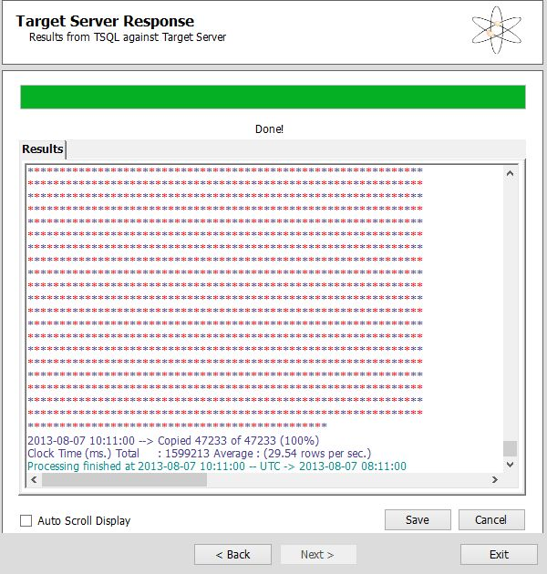

Migracja bazy SQL do chmury Azure jest prostym procesem, aby go dokonać bez większych problemów należy zrozumieć jak to działa. CODEPLEX udostępnia programik to migracji bazy SQL bezpośrednio z serwera bazodanowego w chmurę. Brzmi prosto prawda? Pomimo tego warto wspomnieć o pewnych wymaganiach jakie stawiane są przez Azure. Po pierwsze: omawiamy kwestie w której korzystamy z Cloud Services - gdzie baza SQL stoi na zdefiniowanej przez nas instancji - wybieramy w jakim rejonie świata znajduje się serwer oraz moc instancji. Po drugie: aby tego dokonać musimy sobie zdać sprawę, że mamy ograniczony dostęp do ustawień bazy. Cloud Services cechuje się tym, że korzystamy interfejsu Azure-owego do zarządzania bazą lub łączymy się z serwerem przez Management Studio gdzie otrzymujemy okrojone możliwości o których wspomnę w dalszej części. Głównym problem jest to że nie możemy w prosty sposób użyć funkcji przywrócenia bazy SQL z pliku .bak ponieważ nie mamy takiej opcji. Jedyna możliwość to deploy bazy z pliku .bacpac. Dlatego aby dokonać migracji bazy z środowiska produkcyjnego potrzebujemy narzędzia SQL Database Migration Wizard: [sqlazuremw.codeplex.com](http://sqlazuremw.codeplex.com/ "http://sqlazuremw.codeplex.com/"). Zanim jeszcze rozpoczniemy pracę z programem należy zdefiniować dostęp z jakiego adresu IP będziemy dokonywać migracji, wygląda to tak:



<!--truncate-->

Powyższa ilustracja obrazuje jak wygląda zdefiniowany scope IP dostępowy dla naszej instancji SQL. Po dokonaniu tej czynności przechodzimy do narzędzia CODEPLEX-a (warto go uruchomić jako administrator):



Po uruchomieniu wybieramy Migrate Database, przechodząc dalej wybieramy połączenia się z naszą bazą lokalną, którą chcemy migrować. W kolejnych krokach wybieramy bazę z z serwera SQL i generujemy dla niej skrypt, który będzie interpretowany w chmurze Azure w celu jej importu. Klikamy dalej aby generować kod.



Wygenerowany kod możemy zapisać, ale nie jest to wymagane. Warto przejrzeć powyższe okienko czy nie pojawiły się błędy podczas generowania skryptu. Po weryfikacji proponuję również zajrzeć na dysk C: do katalogu SQLAzureMW. Znajdziemy w nim pliki wygenerowane, które będą eksportowane do naszej chmury w następnych krokach.


Wróćmy zatem do migracji, połączmy się z naszą bazą w Azure. Aby zalogować się do bazy podajesz utworzone wcześniej dane, a nazwę serwera znajdziesz a panelu Azure.


W następnych krokach zaznaczasz bazę do której chcesz importować bazę, możesz również poziomu wizard-a utworzyć nową bazę w Azure. W zależności od wielkości bazy i przepustowości Twojego łącza będzie trwać migracja bazy. W moim przypadku baza miało koło 3gb i trwało około 2h. Na marginesie nie wiem czemu w Result Summary mam podany czas 11 minut, ale może to związane jest z tym że czas podany dotyczył danego procesu kopiowania. Najważniejsze jest aby migrator przeniósł wszystkie elementy bez error-ów.


Na koniec proponuję podłączyć się do bazy przez Management Studio i zweryfikować wielkość bazy po migracji. Możesz to zrobić następującym poleceniem:
```
SELECT (SUM(reserved_page_count) * 8192) / 1024 / 1024 AS DbSizeInMB
FROM sys.dm_db_partition_stats
```


Na czerwono zaznaczyłem wielkość mojej bazy i teraz mogę być pewny że baza przeniesiona nie ma żadnych ubytków i została poprawnie przemigrowana. Wyżej zaznaczyłem Task dotyczący bazy, można zauważyć że mamy ograniczenia związane z modyfikacjami bazy, nie wspomnę o tym że w przypadku SQL Services nie mamy nawet funkcji "Properties" dla bazy. Dlatego zanim przemigrujesz bazę zastanów się czego będziesz potrzebować. Zawsze pozostaje możliwość zakupienia serwera z z SQL, który daje nam wszystkie możliwości konfiguracji. W razie pytań zapraszam! Możesz pisać do mnie w komentarzach i na priv, pozdrawiam!