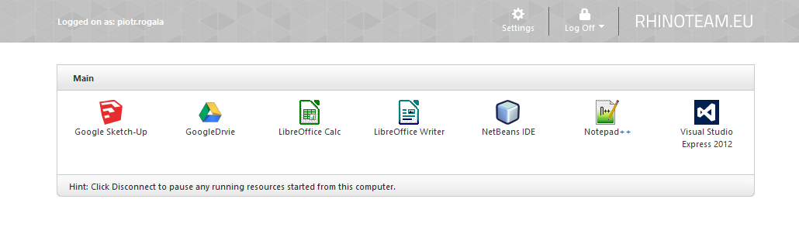
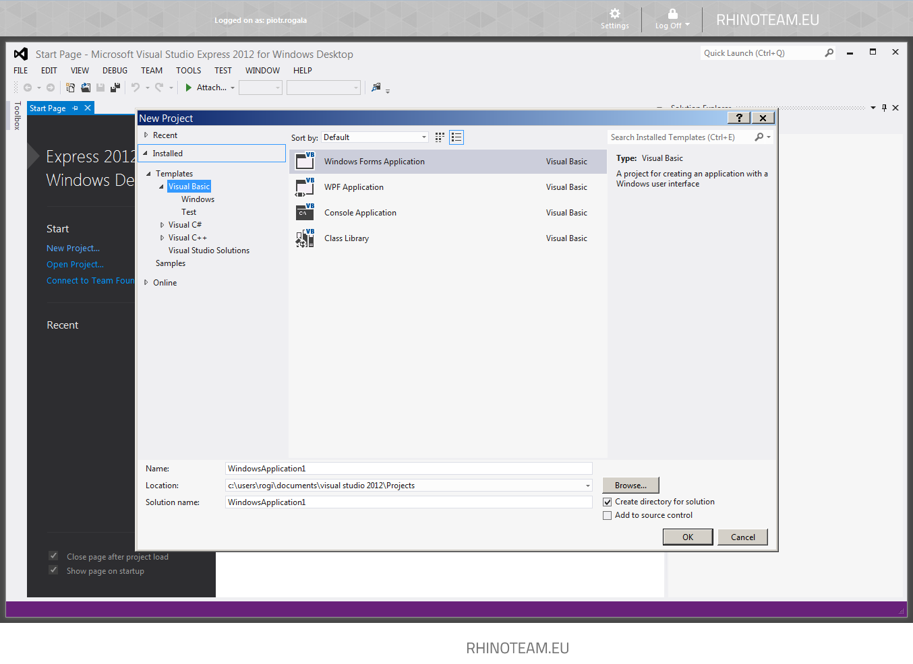

---
authors:
  - progala
date: "2013-10-17"
description: RhinoApp to najnowsze rozwiązanie do wirtualizacji aplikacji. W chmurze możemy wykorzystać aplikacje bez instalowania ich na swoim środowisku.
hide_table_of_contents: true
keywords:
  - Cloud Computing
  - Cloud Apps
  - RhinoApps
  - Rhino Team
  - Aplikacje w chmurze
slug: rhinoapps-pilot
tags:
  - Cloud Computing
  - Cloud Apps
  - RhinoApps
  - Rhino Team
title: RhinoApps – Uniwersalność, skalowalność i aplikacje – nowy wymiar usług Cloud Computing
---

Codziennie jesteśmy bombardowani sloganami: "dane w chmurze", "przetwarzanie w chmurze" itp. Cloud-y stały się modne i każdy chce dołączyć się do tego trendu. Z tego powodu rzadko spotyka się naprawdę innowacyjne produkty, wykorzystujące w pełni możliwości, jakie dają nam chmury.

<!-- truncate -->

Polski rynek IT jest jednym z przodujących na świecie, dlatego zaprezentuję wszystkim czytelnikom naprawdę nowoczesny projekt zespołu z Wrocławia. Rhino Team przedstawia rozwiązanie cloud-owe, z pomocą którego możemy korzystać z aplikacji bez ich instalacji. Idea opiera się na dostarczeniu aplikacji desktopowej z mocą obliczeniową serwerów w chmurze na każde urządzenie. W zależności od potrzeb możemy zbudować własne środowisko do pracy w oparciu o wydajny serwer obliczeniowy bez wiedzy na temat konfiguracji. Ostatecznie użytkownik otrzymuje gotowe rozwiązanie, gdzie uruchamia wszystkie programy. Cała techniczna część działa w tle, będąc niewidoczną dla użytkownika końcowego. Pilot: Już 19.10.2013 ruszy portal z rejestracją. W skrócie zaprezentuję, jak wygląda działanie aplikacji Rhino. Panel logowania jest bardzo prosty i zrozumiały, wystarczy, że wpiszemy swoje dane, a następnie zostaniemy przeniesieni do store-a z aplikacjami.

Do wyboru mamy aplikacje freeware, ale oferta aplikacji będzie systematycznie rozwijana. Po kliknięciu na ikonę uruchamia nam się aplikacja bez konieczności instalacji na lokalnym komputerze. Ponadto możemy uruchomić tę samą aplikację na tablecie czy telefonie.

W tym segmencie została zlikwidowana granica. Od teraz możemy używać dostępnych aplikacji na systemach Windows, Windows Phone, Linux, Mac, IOS, Android.  Jeśli wykonujesz projekty na różnych komputerach wystarczy, że rozpoczniesz korzystanie z aplikacji w chmurze i swój program będziesz miał ze swoim projektem zawsze pod ręką.

Zachęcam do rejestracji, która rusza 19.10.2013 o godzinie 20.00 na stronie
[www.rhinoapps.eu](http://rhinoapps.eu "http://rhinoapps.eu")
Wszystkich dodatkowych informacji dowiemy się w raz z uruchomieniem kompletnej strony.

<!--truncate-->