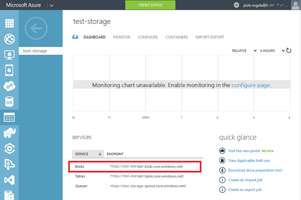
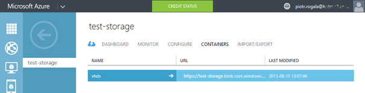
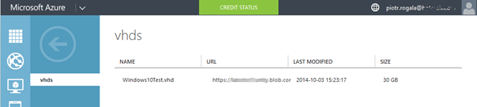
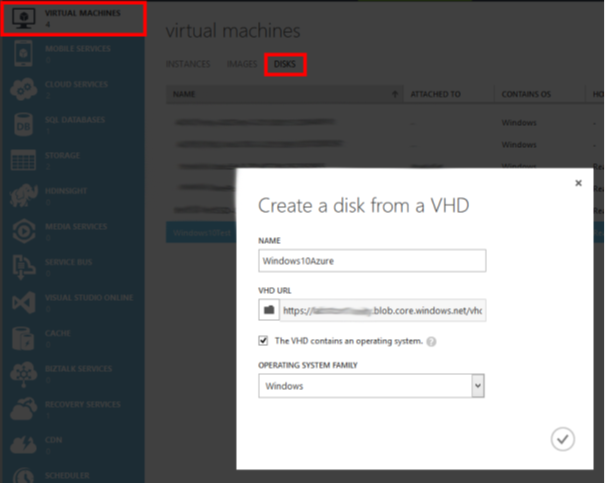

W tym artykule opiszę jak możemy przemigrować do Azure dysk z Windows 10 TechPreview.

1. Przygotowujemy dysk .vhd
    - Jeśli posiadamy dysk .vhdx możemy użyć polecenia PS w celu przekonwertowania:

Convert-VHD –Path “D:\Hyper-V\Windows10\Virtual Hard Disks\Windows10.vhdx" –DestinationPath “D:\Hyper-V\Windows10\Virtual Hard Disks\Windows10.vhd



<!--truncate-->



1. Wybieramy storage, na który będziemy migrować dysk, najbardziej nas interesuje linki blobs.
2. Odpalamy PowerShell-a dla Azure
    - Jeśli nie masz przystawki Azure-owej możesz pobrać ją tu: [http://go.microsoft.com/?linkid=9811175](http://go.microsoft.com/?linkid=9811175)
3. W konsoli wklepujemy:

```
$cred = Get-Credential
Add-AzureAccount -Credential $cred
$sourceVHD = “D:\Hyper-V\Windows10\Virtual Hard Disks\Windows10.vhdx"
$destinationVHD="https://test-storage.blob.core.windows.net/vhds/Windows10-Test.vhd"
Add-AzureVhd -LocalFilePath $sourceVHD -Destination $destinationVHD -NumberOfUploaderThreads 5
```

**Dla $source i $destynation zmieniamy analogicznie do naszych potrzeb**

5. Efekt przenoszenia do Azure.



6. Przechodzimy do Virtual Machines > Disk
    
    - Tutaj wybieramy nasz .vhd i klikamy Create.
    
    - Wypełniamy nazwę obrazu oraz wskazujemy go w naszym kontenerze z dyskami.



1. Chcąc teraz skorzystać z naszego dysku przechodzimy do galerii z systemami New > Compute > Virtual Machine > From Gallery
    - Klikając na My Images zobaczymy nasz przygotowany dysk.

I tak udało nam się przenieść wirtualkę do Azure, może to być skonfigurowana gotowa do pracy bądź dysk bazowy „template” który możemy wykorzystywać przy tworzeniu innych maszyn.

**Opcja ściągnięcia dysku .vhd z Azure:**

1. Odpalamy konsole PowerShell Azure
    - Wklepujemy:
```
$cred = Get-Credential
Add-AzureAccount -Credential $cred
$sourceVHD = "https://storage-test.blob.core.windows.net/vhds/Windows10Test.vhd"
$destinationVHD = "D:\Hyper-V\Windows10\Virtual Hard Disks\Windows10.vhd"
Save-AzureVhd -Source $sourceVHD -LocalFilePath $destinationVHD -NumberOfThreads 5
```