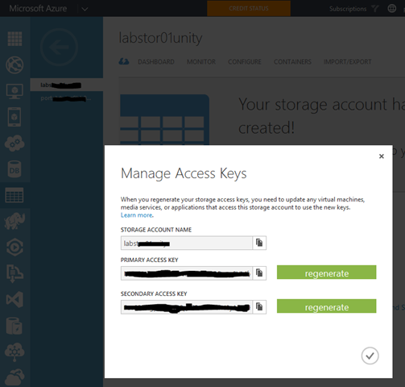
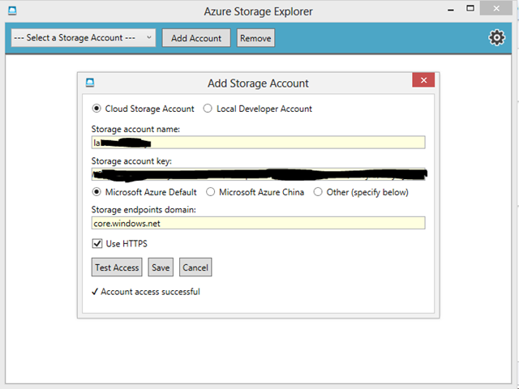
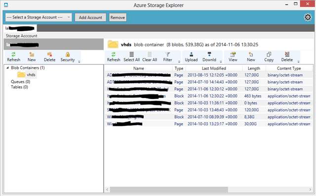

Jeśli korzystacie z Azure i zastanawiałeś się jak możesz w prosty sposób zarządzać storage'ami polecam Azure Storage Explorer wydany przez CodePlex-a. Narzędzie możemy pobrać tu: [http://bit.ly/1O4n0pX](http://bit.ly/1O4n0pX "https://azurestorageexplorer.codeplex.com/releases/view/54430"). Jak to połączyć z Azure-m? Logujesz się do portalu, klikasz na kontener z zawartością dysków. Na dole strony pojawi się ikona “Keys” dotyczy ona Manage Access Keys. Są to dane wygenerowane, które umożliwiają nam tworzenie federacji pomiędzy portalami lub programami takimi jak ASE.

Kopiujemy dane z okienka Manage Access Keys i wklejamy analogicznie do Azure Storage Explorer.

<!--truncate-->

Efektem jest podpięcie storage-a gdzie możemy zarządzać dyskami bez logowania do portalu Azure-wego. Jednym z atutów jest proste przenoszenie dysków .vhd z lokalnego urządzenia do chmury. Nie będę sie rozpisywał i zachwalał, zapraszam do testów, jeśli masz pytania zapraszam.

