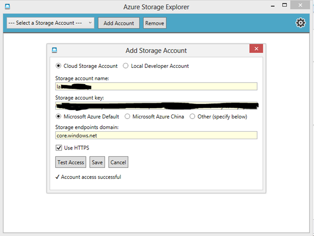
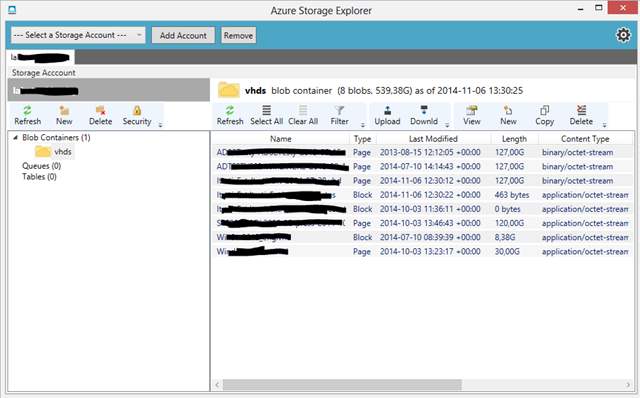

Jeśli korzystacie z Azure i zastanawialiście się, jak w prosty sposob zarzadzać storage'ami, polecam Azure Storage Explorer wydany przez CodePlex. Narzędzie możemy pobrać tutaj: [http://bit.ly/1O4n0pX](http://bit.ly/1O4n0pX "https://azurestorageexplorer.codeplex.com/releases/view/54430"). Jak połączyć je z Azure? Logujemy się do portalu, klikamy na kontener z zawartością dysków. Na dole strony pojawi się ikona "Keys" dotycząca Manage Access Keys. Są to wygenerowane dane, które umożliwiają tworzenie federacji pomiędzy portalami lub programami, takimi jak ASE.

Kopiujemy dane z okienka Manage Access Keys i wklejamy je analogicznie do Azure Storage Explorer.

<!--truncate-->

Efektem jest podpięcie storage'a, w którym możemy zarządzać dyskami bez logowania do portalu Azure. Jednym z atutów tego narzędzia jest proste przenoszenie dysków .vhd z lokalnego urządzenia do chmury. Nie będę się rozpisywał ani zachwalał - zapraszam do testów. Jeśli masz pytania, zapraszam.

