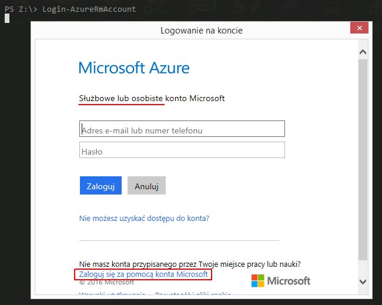

Każdy prawdziwy admin powinien korzystać nie tylko z okienek, a między innymi z PowerShell-a. Dlatego napiszę parę słów na temat zarządzania Azure-m oraz zaprezentuję jak łatwo można się połączyć z Azure za pomocą konsoli PS. W dwóch stepach opiszę co należy zrobić, aby zrobić to szybko i ze zrozumieniem tematu.

Małe wprowadzenie: Azure przechodzi domyślnie w tryb kontenerowy tak zwany Resource Groups nazywany też ARM czyli Azure Resource Manager. Z punktu widzenia architekta, admina, specjalisty IT zmienia to wiele rzeczy począwszy od poleceń PowerShell-owych, aż po budowanie aplikacji w chmurze. Wszystkich wnikliwych informacji dowiemy się na stronach MS natomiast my skupimy się jak postawić pierwsze kroki w Azure poprzez konsolkę PS.

**Step 1:** Po pierwsze potrzebujemy Powershell dla Azure, który ściągniemy tutaj: [https://github.com/Azure/azure-powershell/releases/download/v1.0.2-December2015/azure-powershell.1.0.2.msi](https://github.com/Azure/azure-powershell/releases/download/v1.0.2-December2015/azure-powershell.1.0.2.msi "https://github.com/Azure/azure-powershell/releases/download/v1.0.2-December2015/azure-powershell.1.0.2.msi")

**Step 2:** Podłączyć się do Azure możemy dwoma komendami, które umożliwią nam zarządzanie naszymi subskrypcjami.

- Add-AzureAccount (tryb normalny ASM)
- Login-AzureRmAccount (tryb kontenerowy ARM)

<!--truncate-->

W zależności czy korzystamy z Live ID czy Azure AD wybieramy za pomocą jakiego konta chcemy się logować, podajemy dane i gotowe!

Aby pobrać informacje na temat subskrypcji korzystamy z poleceń:

- Get-AzureSubscription (ASM)
- Get-AzureRMSubscription (ARM)

Gdy korzystamy z wielu subskrypcji należy wybrać na której będziemy pracować:

- Set-AzureSubscription (ASM)
- Select-AzureRMSubscription (ARM)

Nowe wersje PowerShell możemy śledzić na stronie: [https://github.com/Azure/azure-powershell/releases](https://github.com/Azure/azure-powershell/releases)

To jest jedna z możliwości podpięcia się do zasobów w Azure. Jeśli podoba wam się powyższa treść zapraszam do komentowania gdyż to zachęci mnie pisania kolejnych postów i nie tylko wprowadzających do PowerShell-a 🙂.
