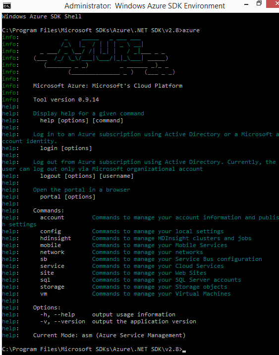
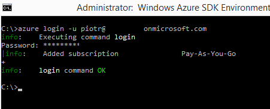

W poniższym artykule opiszę w skrócie jak zabrać się do Azure CLI. Z jego pomocą będziemy mogli administrować chmurą Azure z systemu Windows jak i Linux. Aby wystartować potrzebujemy pliki instalacyjne:

**node.js:** [https://nodejs.org/en/download/](https://nodejs.org/en/download/ "https://nodejs.org/en/download/")

**Azure CLI:**  [https://azure.microsoft.com/en-us/documentation/articles/xplat-cli-install/](https://azure.microsoft.com/en-us/documentation/articles/xplat-cli-install/ "https://azure.microsoft.com/en-us/documentation/articles/xplat-cli-install/")

Po ich instalacji z poziomu CMD mamy dostępny moduł Azure CLI. Wpisz w oknie CMD: azure a następnie zobaczysz informacje dotyczące komend azure-owych.

]

<!--truncate-->

Aby zalogować się do azure potrzebujemy pliku z informacjami o subskrypcji oraz konta @domena.onmicrosoft.com.

Korzystamy z komend:

1. Pobranie pliku subskrypcji:
    
    azure account download
    
    (otworzy się okno przeglądarki gdzie po zalogowaniu pobierzemy plik .publishsettings)
2. Import pliku subskrypcji:
    
    azure account import "C:\Temp\Azure-Moja-Subskrypcja-2015-credentials.publishsettings"
    
3. Logowanie do azure:
    
    azure login –u piotr@justcloud.onmicrosoft.com
    

Podobają Ci się konkretne i krótkie posty? Komentuj i pisz co Cię interesuje!
