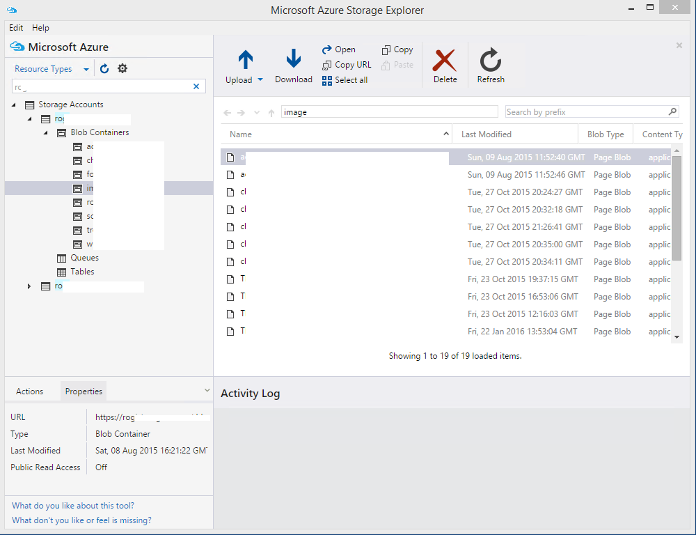
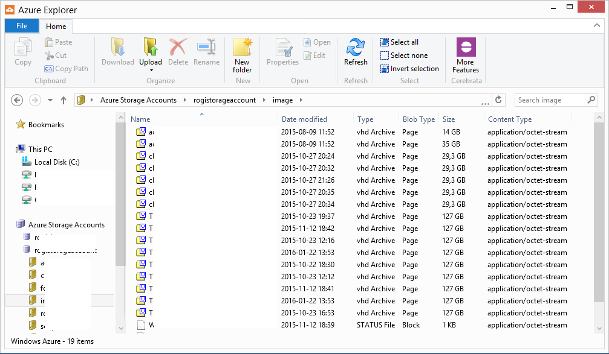
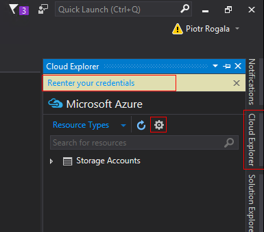
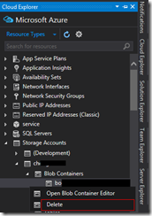

Zarządzanie zawartością danych w blob'ach w Azure jest kluczowe do utrzymywania porządku. PowerShell jest jak najbardziej odpowiednim narzędziem do takich operacji aczkolwiek jeśli zależy Ci na czasie, aby przejrzeć sto dysków to PowerShell może stać się uciążliwy i mało pomocy. Poniżej przedstawię aplikacje, które mogą nam pomóc w szybkim i efektywnym zarządzaniem danymi przechowywanymi w Azure.

**Microsoft Azure Storage Explorer**, producent Microsoft: [http://storageexplorer.com/](http://storageexplorer.com/ "http://storageexplorer.com/")

Od wydania ulepszonej wersji mogę stwierdzić, że jest to najlepsze narzędzie do pracy z dyskami w chmurze. Możliwość zalogowania się danymi chmurowymi jest zaletą (w poprzedniej wersji nie było to dostępne), a następnie zobaczymy wszystkie storage-y i blob'y w dostępnej subskrypcji. Minusem aplikacji jest długi czas ładowania danych i wyświetlania zawartości blob'ów.

**Azure Explorer**, producent: Cerebrata: [http://www.cerebrata.com/products/azure-explorer/introduction](http://www.cerebrata.com/products/azure-explorer/introduction "http://www.cerebrata.com/products/azure-explorer/introduction")

<!--truncate-->

Azure Explorer jest to darmową alternatywą programu: CloudXplorer ([http://clumsyleaf.com/products/cloudxplorer](http://clumsyleaf.com/products/cloudxplorer "http://clumsyleaf.com/products/cloudxplorer")). W porównaniu do aplikacji Microsoftu nie możemy się zalogować danymi chmurowymi tylko każdy storage trzeba dodać osobno poprzez podanie nazwy i access key-a. Przeglądanie zawartości blob'ów odbywa się bardzo szybko.

**Visual Studio**, producent: Microsoft wersja free Express: [https://www.visualstudio.com/en-us/downloads/download-visual-studio-vs.aspx](https://www.visualstudio.com/en-us/downloads/download-visual-studio-vs.aspx "https://www.visualstudio.com/en-us/downloads/download-visual-studio-vs.aspx")

Być może nie jest to najlepsze rozwiązanie, ale chciałem przedstawić Visual Studio jako alternatywę dla programów, które są wyłącznie przeznaczenia przeglądania storage-ów. Visual Studio wciąż dopracowuje wyświetlanie zasobów chmurowych przez co zawsze może nas coś zaskoczyć po aktualizacji. W odróżnieniu od wspomnianych wyżej aplikacji Visual Studio wyświetli nam wszystkie utworzone zasoby w subskrypcji.

Podsumowując: wszystkie wyżej wspomniane aplikacje są przydane do pracy z Azure i oferują podobne możliwości. Zapraszam do testów i wyrażania swojej opinii!
