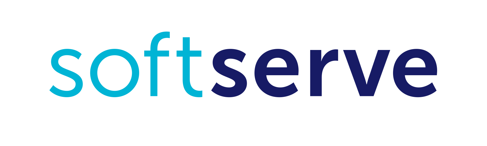

Wrocławska grupa Azure powoli się rozwija i pojawia się na niej coraz więcej ciekawych osób. Jeśli chcecie być na bieżąco ze wszystkimi news'ami podam wam parę linków jak dotrzeć do grupy i jak monitorować wszystkie wydarzenia.

1. **Meetup - kliknij Join us.**
    - [http://www.meetup.com/Microsoft-Azure-Users-Group-Poland/](http://www.meetup.com/Microsoft-Azure-Users-Group-Poland/)
2. **Facebook Page Like grupy MAUGP**
    - [https://www.facebook.com/groups/azureugpl/](https://www.facebook.com/groups/azureugpl/)
3. **Facebook Page Like grupy JustCloud** (informacje o spotkaniach Wrocławskiej grupy)
    - [https://www.facebook.com/justcloudpl/](https://www.facebook.com/justcloudpl/)

Ponadto za nami wiele ciekawych tematów gdzie udzielają się głównie **Piotr Rogala** i **Marek Zalewski**. Prezentacje w ostatnim czasie dotoczyły takich tematów jak: ARM, Docker, Licencjonowanie w Azure, Azure Web Apps, CDN, OMS. Prezentacje możecie odszukać za pomocą poniższego linku:

- [http://maugp.justcloud.azurewebsites.net](http://maugp.justcloud.azurewebsites.net)

Jeśli chcecie się udzielać i rozwijać w stronę nowych rozwiązań dołącz do nas i zaprezentuj się! Na koniec dziękuję za sponsoring ostatniego spotkania firmie SOFTSERVE i zapraszam kolejne zainteresowane nowymi rozwiązaniami w oparciu o chmury: Azure, AWS, GPC.

