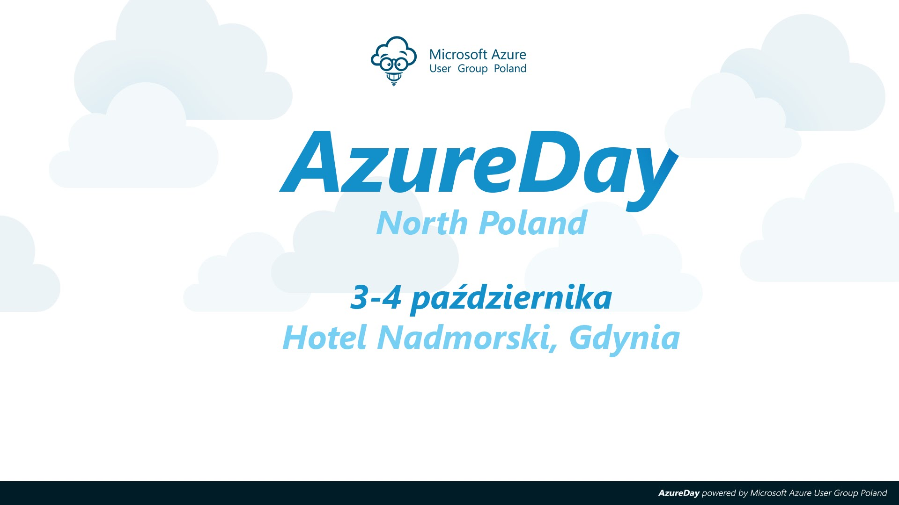

---
authors:
  - progala
date: "2016-09-18"
description: Największa konferencja Microsoft Azure w Polsce AzureDay North Poland 2016!
hide_table_of_contents: true
keywords:
  - azureday
  - konferencja
  - microsoft
slug: azureday-north-poland-2016
tags:
  - azureday
  - konferencja
  - microsoft
title: AzureDay North Poland 2016 - JustCloud
---

Wiesz że **3-4 Października** jest konferencja **AzureDay** w Gdyni? I piszę o tym nie bez powodu na łamach bloga ponieważ będę miał przyjemność poprowadzić tam swoją autorką sesję na temat: Azure Resource Manager – zautomatyzowane powoływanie wirtualnych maszyn w chmurze.

<!-- truncate -->

**Krótki opis mojej prezentacji**: Sesja będzie techniczna, a zarazem prezentująca Azure Resource Manager gdzie dowiemy się, co to tak naprawdę jest i jakie wniosło zmiany w Azure. Zostanie omówiony i zaprezentowany proces automatyzacji z wykorzystaniem skryptów .json. Podczas demo na żywo obejrzymy jak działa z bliska konfigurowanie własnego skryptu .json, który powoła maszyny wirtualne w Azure. Deployment zostanie zaprezentowany z wykorzystaniem Visual Studio oraz konsoli PowerShell. Jeśli interesują Cię tematy ułatwiające administrację i chcesz uprościć swoją pracę to ta sesja zaprezentuje Ci, że praca Administratora nie sprowadza się tylko do przeglądania logów 🙂 Podczas prezentacji zobaczysz: czym jest ARM, organizację pracy z Azure, pracę nad skryptami .json, PowerShell ARM, Visual Studio do deployment'ów w Azure.

Czy wiecie już o ARM wystarczająco żeby ominąć moją sesję? nie wydaje mi sie 🙂 Dlatego szybko kupujcie bileciki na konferencje! Dla wszystkich fanów bloga JustCloud 20% zniżki na wstęp z kodem: WROAZURE

Dlaczego dostajesz taki kod? Ponieważ mam nadzieję że wzbudzę w Tobie chęć przyjechania i budowania nowej społeczności wraz z nami, która rozwija się w Polsce. Jeśli masz pytania nie wahaj się wpisuj w komentarzach na dole.

**Link do strony konferencji:**

- ### [http://azureday.pro/](http://azureday.pro/)

