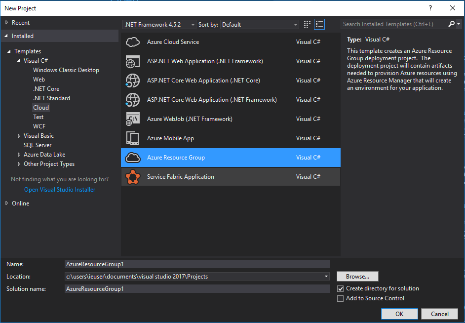
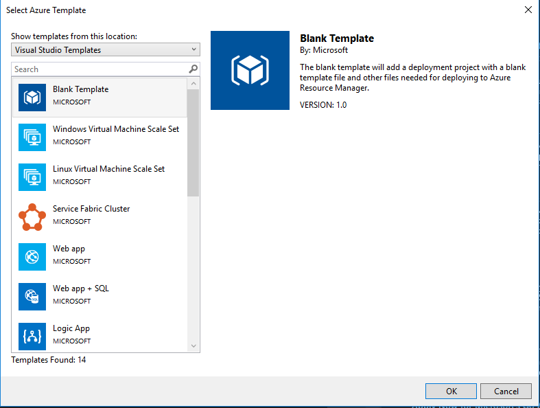
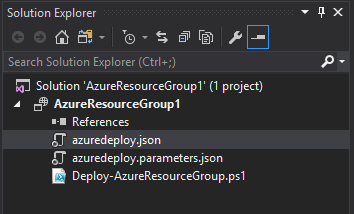
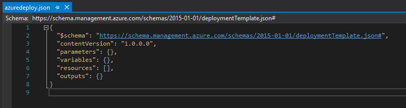
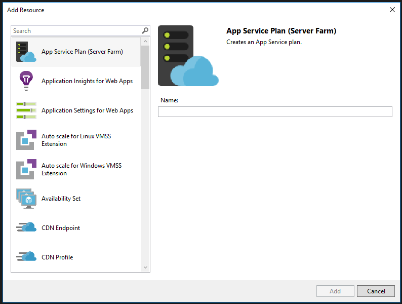

Ten wpis jest przeznaczony dla osób chcących nauczyć się tworzenia szablonów ARM'owych do deployowania w Azure. Visual Studio ma tylko nam pomóc w pracy z szablonem natomiast moim zdaniem przydaje się na początku pracy z ARM oraz przy rozbudowanych szablonach. Po pierwsze podczas edycji plików .json w VS zobaczymy strukturę całego szablonu co pomoże nam zrozumieć co potrzebujemy, żeby działał poprawnie. Po drugie gdy mamy bardzo duże szablony VS pomaga nam odnaleźć się w nim poprzez JSON Outline, w którym w wygodny sposób możemy sprawdzić wszystkie elementy: parameters, variables, resources.

Cel: Stworzyć czysty szablon ARM z wykorzystaniem Visual Studio 2017.

Do realizacji celu potrzebujemy:

- Visual Studio 2017 Community **(FREE)**: [https://www.visualstudio.com/thank-you-downloading-visual-studio/?sku=Community&rel=15](https://www.visualstudio.com/thank-you-downloading-visual-studio/?sku=Community&rel=15)
- Uwaga: podczas instalacji należy dodać moduł: **"Azure development"**

Utworzenie projektu nie jest niczym nadzwyczajnym poza wybraniem odpowiedniego template'a. Aby utworzyć projekt związany z szablonem ARM należy wybrać z grupy Cloud: Azure Resource Group.

<!--truncate-->

Następnie wybieramy template: Blank, który utworzy nam czysty szablon ARM.

Gdy szablon się utworzy w prawej części zobaczymy pliki *.json oraz *.ps1. Plik azuredeploy.json jest głównym plikiem związanym z tworzeniem zasobów w resouce grup'ie, azuredeplyment.parameters.json jest plikiem definiującym parametry potrzebne do wykonania głównego pliku azuredeploy. Plik Deploy-AzureResourceGroup.ps1 odpowiada za sprawdzenie czy Resource Group'a jest utworzona i ewentualne utworzenie jej przed wykonaniem deploymentu, a końcu zdeploy'owanie projektu.

Plik azuredeploy.json jest zbudowany z 4 sekcji: parameters, variables, resources, output. Sekcja parameters związana jest z zdefiniowaniem parametrów, które mają być użyte w dalszej części projektu. Sekcja variables to zmienne gdzie definiujemy na "sztywno", które są wykorzystywane w sekcji resources. Sekcja resources jest najważniejsza ponieważ w niej definiujemy wszystkie zasoby, które mają zostać utworzone w czasie deploy'mentu. Sekcja output nie jest wymagana natomiast w niej możemy zdefiniować jakie dane wyświetlić, które zobaczymy po utworzeniu deploymentu np. IP serwera, nazwa serwera, itp.

Plik azuredeploy.parameters.json jest plikiem ze zmiennymi w celu modyfikacji parametrów głównego pliku z szablonem(azuredeploy.json). Tak naprawdę nie musimy z niego korzystać możemy tworzyć projekt w oparciu o zdefiniowane parametry w pliku z deploymentem. Jeśli chcemy tworzyć projekt, który będzie wykonywany często z VS możemy skupić się na tworzeniu tego pliku, aby móc w estetyczny sposób edytować parametry podczas deplyomentu. Dokładnie zostanie to opisane w kolejnym wpisie na blogu. 

Po lewej stronie mamy zasoby szablonu w wizualnej formie. Możemy również dodawać nowe zasoby lub je usuwać za pośrednictwem widocznych dwóch ikonek z plusem i z x'ksem.

Po wybraniu ikony z dodaniem zasobu możemy wybrać spośród gotowej grupy interesujący nas zasób i go dodać. Po wybraniu w zależności od wybranego zasobu należy podać dane typu Name.

W ten oto sposób utworzyłeś nowy projekt, który po dodaniu zasobów jest gotowy do deploy'owania. W kolejnym wpisie utworzymy przykładowy plik szablonu.
