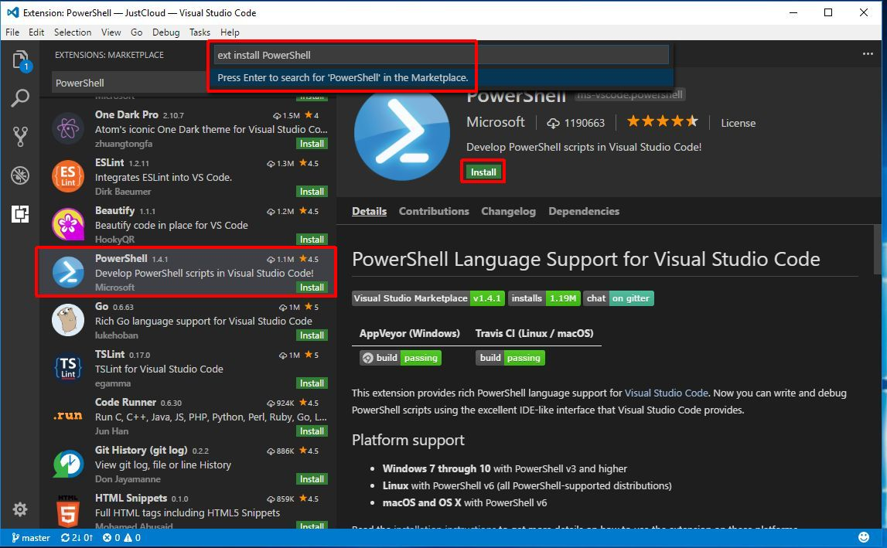
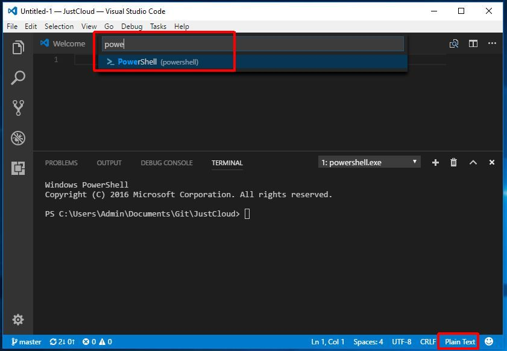
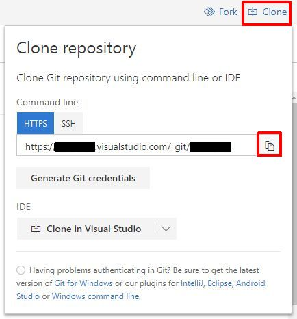
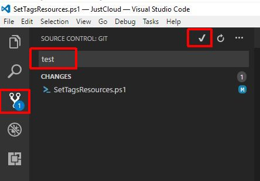

---
authors:
  - progala
date: "2017-08-02"
description: Wykorzystaj w pełni Visual Studio Code oraz GIT! W tym artykule dowiesz się jak skonfigurować swoje środowisko do pracy.
hide_table_of_contents: true
keywords:
  - microsoft
  - powershell
  - powershell-ise
  - sublime
  - visual-studio
  - visual-studio-code
slug: visual-studio-code-i-git-zamiast-powershell-ise
tags:
  - microsoft
  - powershell
  - powershell-ise
  - sublime
  - visual-studio
  - visual-studio-code
title: Visual Studio Code i Git zamiast PowerShell ISE - UPDATED
---

Większość z was zapewne widziała już Visual Studio Code taki Visual Studio w wersji "light". Program jest dostępny na platformy Windows, Linux, Mac można powiedzieć, że to dosyć dziwne i takie nie Microsoft'owe a zarazem jest bardzo poważny krok w stronę DevOps'ów.

<!-- truncate -->

Jeśli używałeś wcześniej różnych edytorów tekstowych to pewnie miałeś bądź nadal używasz programu Sublime Text. Myślę, że jak użyje określenia odpowiednik to zapewne już wiesz o czym tutaj piszę.

Czym jest Visual Studio Code? Jest to edytor tekstowy z możliwością zainstalowania różnych modułów. Z defaultu program ma kontrolę wersji (wymagana instalacja Git'a) i debug. Ponoć w niedalekiej przyszłości VSC ma zastąpić PowerShell ISE dlatego przejdźmy do konfiguracji, aby móc z niego korzystać.

Do ściągnięcia z: [https://code.visualstudio.com/](https://code.visualstudio.com/)

Instruktarz video: [https://channel9.msdn.com/Blogs/MVP-Azure/Transitioning-from-PowerShell-ISE-to-VS-Code](https://channel9.msdn.com/Blogs/MVP-Azure/Transitioning-from-PowerShell-ISE-to-VS-Code)

<!--truncate-->

Instalacja bardzo prosta: "next/next/next"

Aby korzystać z comand line'u PowerShella należy doinstalować moduł: [https://marketplace.visualstudio.com/items?itemName=ms-vscode.PowerShell](https://marketplace.visualstudio.com/items?itemName=ms-vscode.PowerShell)

W VSC naciskamy Ctrl +P i wklejamy:

```sh
ext install PowerShell

```



Restartujemy VSC i klikamy New file, żeby nasz plik był używany jako skrypt PowerShell’owy możemy go zapisać jako .ps1 lub wybrać w dolny prawym rogu "Plain Text" i wpisać powershell. Dopiero teraz możemy używać obszaru roboczego jak w dotychczasowym PowerShell ISE i działają skróty F5 i F8 do wykonywania poleceń. Jeśli jakimś cudem nie widzisz okna Terminal możesz je włączyć View > Integrated Terminal.



Przykład z "Get-Service" + F8


Chcesz używać Git'a? Poniżej przedstawię jedną z szybkich opcji jak sobie poradzić z używaniem Git'a z poziomu Visual Studio Code - tutaj tylko dodam, że nie jest to jedyna opcja i zależy to oczywiście od umiejętności pracy z Git'em. Aby szybko sobie skonfigurować środowisko do pracy z Git'em ściągamy instalkę z: [https://git-scm.com/downloads](https://git-scm.com/downloads)

Instalację przeprowadzamy z default'owymi ustawieniami. Następnie restartujemy VSC i klikamy File > Open Folder - teraz otwórz lokalizacje, gdzie będziesz chciał sklonować swoje repozytorium. W moim przykładzie utworzyłem sobie folder Git w Documents (C:\\Users\\Admin\\Documents\\Git). Przechodzimy do okna Terminala, jeśli nie jest on u Ciebie widoczny to możesz wybrać View > Integrated Terminal, aby go wyświetlić. W polu terminala wpisujemy:

```sh
git clone link_do_projektu

```


Jeśli nie wiesz, gdzie jest ten link, poniższy screen powinien to wyjaśnić. Na stronie https://your-project-name.visualstudio.com jest możliwość sprawdzenia dokładnie adresu repozytorium klikając po prawej stronie na górze "Clone"



Po kliknięciu enter wyskoczy okno do zalogowania się a później rozpocznie się klonowania do wskazanej lokalizacji. Po zakończeniu klonowania nasza konfiguracja dobiegła końca. Teraz możemy wrzucić do folderu jakiś skrypt a następnie zauważymy go w VSC na ikonie gałęzi w celu wysłania go do naszego repozytorium jak na poniższym screenie. Jeśli mamy plik, który został utworzony lub z edytowany należy go za commitowac dodając opis zmiany i kliknąć ptaszek. Po zatwierdzeniu na dole należy zrobić synchronizacje. Trzeba pamiętać, aby zawsze przed commitem wykonać synchronizacje, aby mieć pewność że pracujemy zawsze na najnowszych plikach z repozytorium.




