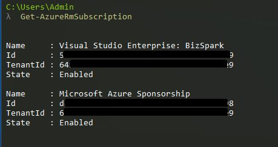
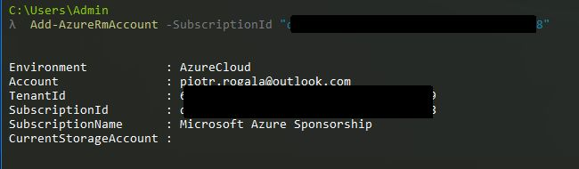
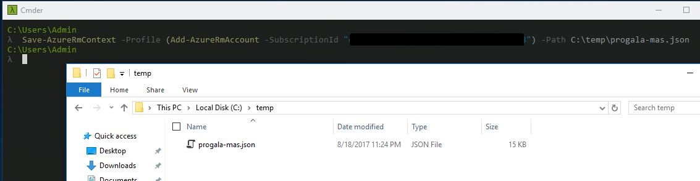
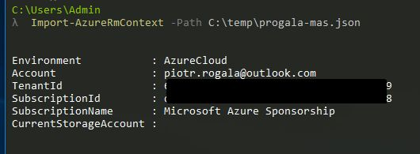

Spotkałem się ostatnio z bardzo ciekawym feature’m związanym z zapisaniem swojego profilu logowania do Azure. W skrócie opisując jeśli używasz często PowerShella, a dodatkowo masz MFA zapewne wiesz jak denerwujące jest ciągłe pytanie o login i hasło. Kiedyś pojawiła się opcja związana z zapisaniem credential’i do pliku a następnie za pomocą skryptu można było sobie zautomatyzować proces logowania. Aczkolwiek przestało to działać po wprowadzeniu ARM'a itd. Aby nie rozwodzić się nad tym przedstawię Ci jak możemy sobie ułatwić życie i pracę ze skryptami, ale o tym później. Na początku proszę Cię o wykonanie aktualizacji PowerShell Azure ponieważ poniższe polecenia są dostępne od wersji 3.8.0 oraz 4.2.0 w celu aktualizacji możesz użyć Web Installer’a z linku poniżej.

**Dokumentacja:** Add-AzureRmAccount: [https://docs.microsoft.com/en-us/powershell/module/azurerm.profile/add-azurermaccount?view=azurermps-3.8.0](https://docs.microsoft.com/en-us/powershell/module/azurerm.profile/add-azurermaccount?view=azurermps-3.8.0) Save-AzureRmContext: [https://docs.microsoft.com/en-us/powershell/module/azurerm.profile/save-azurermcontext?view=azurermps-3.8.0](https://docs.microsoft.com/en-us/powershell/module/azurerm.profile/save-azurermcontext?view=azurermps-3.8.0) Import-AzureRmContext: [https://docs.microsoft.com/en-us/powershell/module/azurerm.profile/import-azurermcontext?view=azurermps-4.2.0](https://docs.microsoft.com/en-us/powershell/module/azurerm.profile/import-azurermcontext?view=azurermps-4.2.0) WebInstaller: [https://www.microsoft.com/web/downloads/platform.aspx](https://www.microsoft.com/web/downloads/platform.aspx)

W moim przypadku mamy dwie subskrypcje i zapisując swój profil mogę zdefiniować jaka ma zostać wybrana subskrypcja w momencie kiedy będę go importował w dalszej części. Na początku pobiore ID Subskrypcji w klasyczny sposób: otwieram okno PowerShella loguję się używając _Login-AzureRmAccount_, a następnie wpisuję _Get-AzureRmSubscrpytion_ i dostaje taki wynik:



Następnie mogę przejść do wykonania polecenia, które mnie zaloguje, a później umożliwi mi zapisanie profilu:
```
Add-AzureRmAccount -SubscriptionId "yyyy-yyyy-yyyy-yyyy"
```
Wynik:



Następne polecenie - zapisanie profilu:
```
Save-AzureRmContext -Path C:\\temp\\progala-mas.json
```


W tym momencie zapisałem swój profil z odwołaniem do wcześniej wskazanej subskrypcji. Jako hint mogę powiedzieć, że możemy użyć funkcji 2w1 jak poniżej:
```
Save-AzureRmContext -Profile (Add-AzureRmAccount -SubscriptionId "yyyy-yyyy-yyyy-yyyy") -Path C:\\temp\\progala-mas.json
```
Żeby móc zaimportować zapisany profil wystarczy użyć polecenia:
```
Import-AzureRmContext -Path C:\\temp\\progala-mas.json
```


W taki sposób możemy swój profil wywołać gdy korzystamy z róznych skryptów itp. Może to być dla kogoś mało atrakcyjne aczkolwiek mogę zdradzić do czego bardzo ta wiedza się przydaje. Mając zagnieżdżone skrypty PowerShellow’e, które wykonuję jako Job'y mają one to do siebie, że wywołane skrypty w tle mają problem z przejęciem sesji z poprzedniego okna gdyż sesja nie jest dziedziczona. Gdy użyjemy polecenia Import-AzureRmContex mamy "gwarancję", że wywołane okno w tle będzie mogło swobodnie korzystać z sesji Azure'owej.
