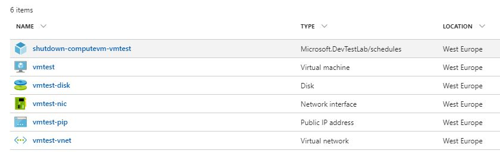
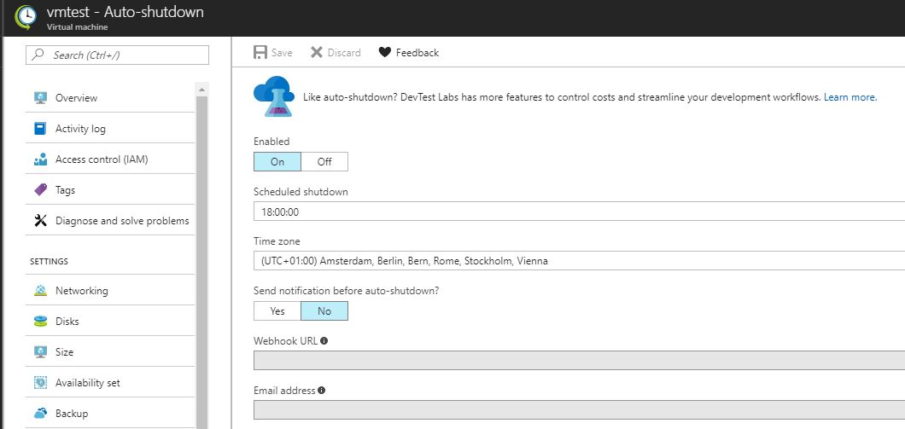

---
authors:
  - progala
date: "2017-09-03"
description: Jak wyłączyć maszynę automatycznie o danej godzinie? Zapomocą tego skryptu zrobisz to!
hide_table_of_contents: true
keywords:
  - arm
  - auto-shutdown
  - azure-resource-manager
  - deplyment
slug: deployment-maszyny-z-funkcja-auto-shutdown-za-pomoca-szablonu-arm
tags:
  - arm
  - auto-shutdown
  - azure-resource-manager
  - deplyment
title: Deployment maszyny z funkcją Auto-Shutdown  za pomocą szablonu arm
---

Szablony ARM mają nam pomać w pracy dlatego kiedy testuję wiele szablonów zdarza mi się, że zapominam o resource'ach, które utworzyłem w Azure co powoduje, że marnuję pieniądzę na subskrypcji. Powodem są zazwyczaj późne godziny pracy i przemęczenie, a później te z deploy'owane wirtualki działają przez parę dni nic nie robiąc.

<!-- truncate -->

Dlatego postanowiłem sobie pomóc i do każego deploy'mentu dodaję wpis który wyłączy wirtualkę o jakiejś godzinie. Poniższy przykład zaprezentuje deplyment Windows'a 2016 z manage disk'iem i "Microsoft.DevTestLab/schedules".

W poprzendich moich postach możesz przeczytać jak zalogować się do Azure za pomocą PowerShell i CLI oraz jak używać do deploymentów Visual Studio Code i Visual Studio.

**Przydatne linki:**

- Wygodny profil logowania: [https://justcloud.azurewebsites.net/blog/profil-logowania-do-azure/](https://justcloud.azurewebsites.net/blog/profil-logowania-do-azure/)
- Logowanie za pomacą CLI: https://justcloud.azurewebsites.net/blog/azure-cli-logowanie/
- Visual Studio Code: [https://justcloud.azurewebsites.net/blog/visual-studio-code-i-git-zamiast-powershell-ise/](https://justcloud.azurewebsites.net/blog/visual-studio-code-i-git-zamiast-powershell-ise/)
- Visual Studio: [https://justcloud.azurewebsites.net/blog/tworzenie-szablonu-arm-visual-studio-2017/](https://justcloud.azurewebsites.net/blog/tworzenie-szablonu-arm-visual-studio-2017/)

**Źródła:**

- Dokumentacja: [https://docs.microsoft.com/en-us/azure/templates/microsoft.devtestlab/schedules](https://docs.microsoft.com/en-us/azure/templates/microsoft.devtestlab/schedules)
- Zones: [https://msdn.microsoft.com/en-us/library/gg154758.aspx](https://msdn.microsoft.com/en-us/library/gg154758.aspx)

<!--truncate-->

**Kod:**

- Szablon dostępny jest na moim github'ie: [https://github.com/RogalaPiotr/JustCloudPublic/blob/master/simple-vm-shutdown-on-time/azuredeploy.json](https://github.com/RogalaPiotr/JustCloudPublic/blob/master/simple-vm-shutdown-on-time/azuredeploy.json)

Szablon jest bezobsługowy dlatego wystarczy wywołać go komendą:

```csv
New-AzureRMResourceGroupDeployment -ResourceGroupName XXX -TemplateURI "https://raw.githubusercontent.com/RogalaPiotr/JustCloudPublic/master/simple-vm-shutdown-on-time/azuredeploy.json" -adminUsername XXX -adminPassword XXX -vmName XXX

```

Poniżej mamy zaprezentowaną sekcję parameters. W niej możemy zdefiniować nazwę VM'ki jaka ma powstać oraz nazwę użytkownika i hasło. Aby ułatwić sobię pracę to dla DNS'u wykorzystałem funkcję unicqueString, aby generować sobię unikatową nazwę dla powstającego serwera.

```json
  "parameters": {
    "adminUsername": {
      "type": "string",
      "metadata": {
        "description": "Username for the Virtual Machine."
      }
    },
    "adminPassword": {
      "type": "securestring",
      "metadata": {
        "description": "Password for the Virtual Machine."
      }
    },
    "dnsLabelPrefix": {
      "type": "string",
      "defaultValue": "[concat('x', uniqueString(resourceGroup().id))]",
      "metadata": {
        "description": "Unique DNS Name for the Public IP used to access the Virtual Machine."
      }
    },
    "vmName": {
      "type": "string",
      "metadata": {
        "description": "Unique DNS Name for the Public IP used to access the Virtual Machine."
      }
    }
  }

```

Sekcja variables. W tej sekcji zefiniowane zostały wszystkie istotne wartości dla deploy'mentu. Wielkość maszyny, wersje Windows'a, adresacje itp. możesz modyfikować tutaj.

```json
  "variables": {
    "windowsOSVersion": "2016-Datacenter",
    "vmsize": "Standard_A1",
    "publicIPAddressName": "[concat(parameters('vmName'), '-pip')]",
    "virtualNetworkName": "[concat(parameters('vmName'), '-vnet')]",
    "nicName": "[concat(parameters('vmName'), '-nic')]",
    "subnetName": "[concat(parameters('vmName'), '-subnet')]",
    "diskname": "[concat(parameters('vmName'), '-disk')]",
    "addressPrefix": "10.0.0.0/16",
    "subnetPrefix": "10.0.0.0/24",
    "subnetRef": "[resourceId('Microsoft.Network/virtualNetworks/subnets', variables('virtualNetworkName'), variables('subnetName'))]"
  }

```

Najważniejsza sekcja odpowidająca za wyłączenie maszyny to "type":"Microsoft.DevTestLab/schedules" w niej definiujemy strefę czasową według której powinien być wyłączony serwer oraz godzinę.

Link do wszystkich stref znajdziesz na górze posta.

```json
    {
      "apiVersion": "2016-05-15",
      "type": "Microsoft.DevTestLab/schedules",
      "name": "[concat('shutdown-computevm-', parameters('vmName'))]",
      "location": "[resourceGroup().location]",
      "dependsOn": [
        "[resourceId('Microsoft.Compute/virtualMachines/', parameters('vmName'))]"
      ],
      "properties": {
        "status":"Enabled",
        "timeZoneId":"W. Europe Standard Time",
        "taskType":"ComputeVmShutdownTask",
        "notificationSettings":{
          "status":"Disabled",
          "timeInMinutes":35
        },
        "targetResourceId":"[resourceId('Microsoft.Compute/virtualMachines', parameters('vmName'))]",
        "dailyRecurrence":{
          "time":"1800"
        }
      }
    }

```

Efekt widoczny w portalu:





Mam nadzięję, że się przyda :)