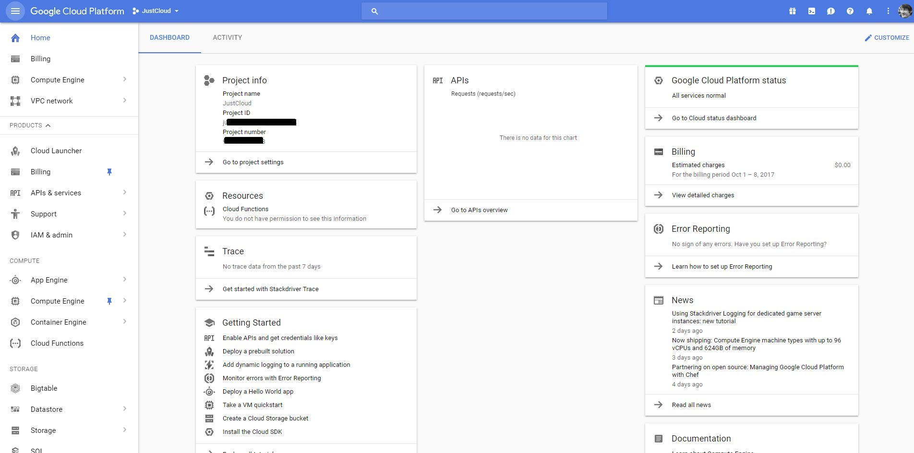
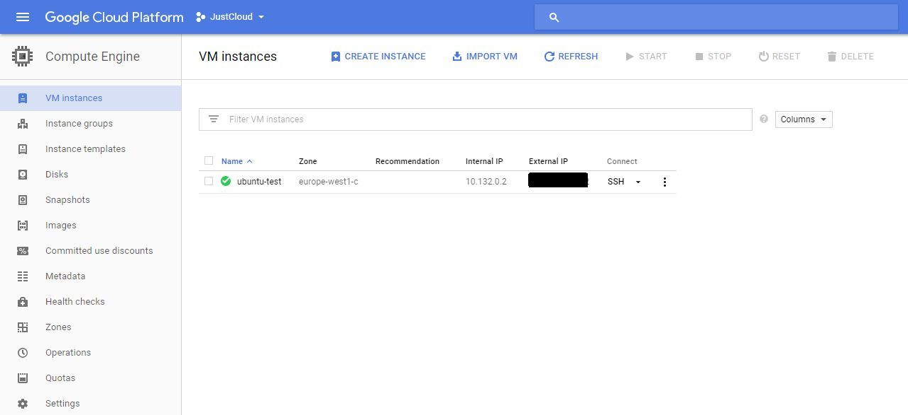

---
authors:
  - progala
date: "2017-10-08"
description: Pierwszy deployment w Google Cloud Platform - jak wdrożyć wirtualną maszynę Ubuntu za pomocą szablonów YAML i Jinja w GCP?
hide_table_of_contents: true
keywords:
  - justcloud
  - gcp
  - azure
  - devops
  - template
  - szablon
  - google cloud platform
  - ubuntu
  - yaml
  - deployment manager
slug: google-cloud-platform-deployment-vm-z-ubuntu
tags:
  - gcloud
  - gcp
  - google cloud-platform
  - ubuntu
title: Google Cloud Platform deployment VM z Ubuntu
---

Zastanawialiście się, jak działają szablony w Google Cloud Platform? Miałem jakiś czas temu możliwość dowiedzieć się, jak to działa, dlatego postanowiłem zrobić mały wpis na ten temat.

<!-- truncate -->

Czym jest GCP (Google Cloud Platform)? Jeśli wiesz, czym jest Azure i Amazon Web Services (AWS), to GCP jest kolejnym dostawcą z podobnymi rozwiązaniami. Od ponad roku GCP jest prężnie rozwijane w stronę rynku wirtualnych maszyn i web serwisów, wychodząc na przeciw AWS-owi i Azure-owi. Powstał portal analogicznie podobny do zarządzania własnymi projektami, można to odwzorować tak, jakby do subskrypcji w Azure.

Portal: [https://console.cloud.google.com](https://console.cloud.google.com)

[](images/capture_010_08102017_140927.jpg)

Google udostępnia własne CLI do zarządzania projektami: [https://cloud.google.com/sdk/](https://cloud.google.com/sdk/) po instalacji SDK możemy używać komend np. do deploymentu. Deployment wirtualnej maszyny różni się znacząco od tych, których używamy w Azure i AWS, mają one rozszerzenia .jinja lub .yaml, gdzie możemy wspomagać nasz deployment plikami pythonowymi .py. Daje to nam duże możliwości konstruowania skomplikowanych deploymentów.

<!--truncate-->

Zajrzyjmy do przygotowanego przeze mnie deploymentu VM z systemem ubuntu: [https://github.com/RogalaPiotr/JustCloudPublic/blob/master/gcloud-simple-ubuntu](https://github.com/RogalaPiotr/JustCloudPublic/blob/master/gcloud-simple-ubuntu)

W poniższym kodzie należy zaktualizować go o wartości nazwy projektu podmieniając "wartość your-project-name", plik vm .yaml:

```yaml
resources:
- type: compute.v1.instance
  name: simple-ubuntu
  properties:
    zone: europe-west1-c
    machineType: projects/your-project-name/zones/europe-west1-c/machineTypes/f1-micro
    disks:
    - deviceName: boot
      type: PERSISTENT
      boot: true
      autoDelete: true
      initializeParams:
        sourceImage: projects/your-project-name/global/images/ubuntu-1604-xenial-v20170815a
        diskType: projects/your-project-name/zones/europe-west1-c/diskTypes/pd-standard
    networkInterfaces:
    - network: projects/your-project-name/global/networks/default
      accessConfigs:
      - name: External NAT
        type: ONE_TO_ONE_NAT

```

Na pierwszy rzut oka plik nie jest skomplikowany, ponieważ plik .yaml jest tylko skrótem definicji, które są wysyłane dalej do schematu, gdzie pod spodem ma dużo więcej funkcji, których nie musimy definiować.

Po zalogowaniu się z CMD do GCP możemy wywołać powyższy deployment używając polecenia:

`gcloud deployment-manager deployments create simple-ubuntu --config vm.yaml`

Po wykonaniu tego polecenia rozpocznie się deployment, a następnie zostanie uruchomiona maszyna z systemem Ubuntu. Zapraszam do testowania i zadawania pytań.




