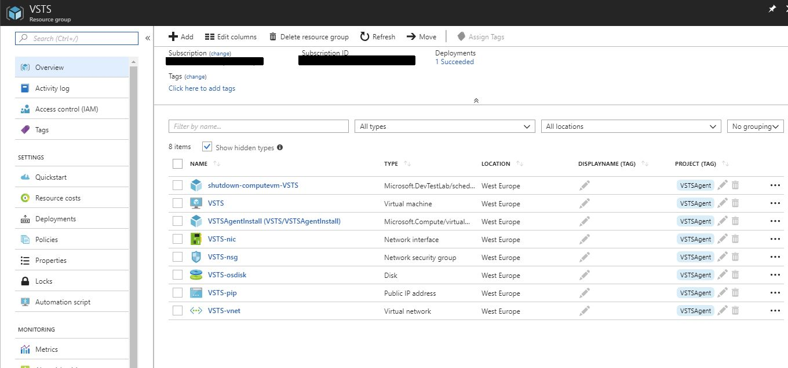
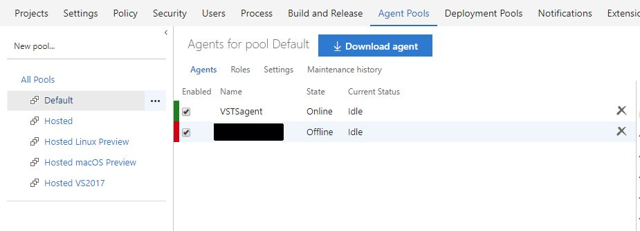

---
authors:
  - progala
date: "2018-05-27"
description: Azure DevOps agent to ważny element wszystkich wdrożeń. Potrzebujesz stworzyć własnego agenta ADO? Zobacz jak to zrobić w prosty i automatyczny sposób! Wszystko znajdziesz we wpisie.
hide_table_of_contents: true
keywords:
  - justcloud
  - ado
  - azure
  - microsoft azure
  - devops
  - agent
  - pipelines
  - deployment
  - azure devops agents
slug: auto-deployment-vm-with-vsts-agent-for-pool
tags:
  - arm
  - automation
  - azure
  - deplyoment
  - json
  - microsoft
  - vsts
  - ado
title: Auto deployment VM with VSTS agent for pool
---

Wszyscy który robią depyolemnty z VSTS spotykają się z sytuacją, kiedy standardowe 240min się kończy i trzeba stworzyć sobie taką maszynę. Sam robiłem taką maszynę parę razy i kiedy znów pojawiła się ta konieczność postanowiłem stworzyć automatyczny deployment który nam stworzy z JSON'a cała maszynkę i podepnie ją do Agent pool w VSTS.

<!-- truncate -->

Miałem parę pomysłów, aby zrobić bardzo uniwersalny template który nie tylko przyda się wam, ale również mi w przyszłości do budowania innych szablonów. Także w skrócie opiszę ciekawostki które zastosowałem szablonie, który znajdziecie na moim GitHubie.

Miałem parę pomysłów, aby zrobić bardzo uniwersalny template który nie tylko przyda się wam, ale również mi w przyszłości do budowania innych szablonów. Także w skrócie opiszę ciekawostki które zastosowałem szablonie, który znajdziecie na moim GitHubie.

##### **GitHub**: [https://github.com/RogalaPiotr/JustCloudPublic/tree/master/simple-vm-with-installation-vsts-agent](https://github.com/RogalaPiotr/JustCloudPublic/tree/master/simple-vm-with-installation-vsts-agent)

Założenie dotyczące szablonu: chciałbym dodać informację, gdzie ważnym jest zwrócenie uwagi, że maszyna ma być odizolowana od naszej sieci wewnętrznej, dlatego szablon jest infrastruktura stand alone, aby było bezpiecznie i w razie czego można ją usuną lub powołać więcej agentów do deployment’ów.

<!--truncate-->

# Opis szablonu

## **Sekcja Parameters:**

w tej sekcji podajemy dane które przydadzą nam się do deplyment’u i automatycznego podłączenia do VSTS'a.

- **adminUsername**, **adminPassword** - lokalny użytkownik i hasło,
- **dnsLabelPrefix** - zostanie automatycznie wygenerowany podczas deployment’u, więc nie ma konieczności go zmieniać,
- **vmName** - nazwa naszej maszyny oraz na podstawie tej nazwy zostaną nazwane wszystkie nasze resource jest: VNET, NSG, Storage...
- **urlvsts** - adres do naszego projektu VSTS np.: https://project1.visualstudio.com,
- **auth** - rodzaj poświadczenia - wybrany domyślnie PAT,
- **token** - token security który umożliwi nam podłączenie się do projektu. Więcej informacji jak stworzyć Security Token poniżej:
   - [**https://docs.microsoft.com/en-us/vsts/build-release/actions/agents/v2-windows?view=vsts**](https://docs.microsoft.com/en-us/vsts/build-release/actions/agents/v2-windows?view=vsts)

- **pool** - nazwa puli, do której zostanie dodana maszyna w VSTS'ie - ustawiony jest na default
- **AccessIPNSG** - adres, który tutaj podacie zostanie dodany do NSG i tylko z tego adresu dostaniecie się po RDP do maszyny,
- **Tag** - tagi mogą ulec waszej modyfikacji ustawione są na Project: VSTSAgent.

## **Sekcja Variables:**

- __vmsize__ - ustawiony na "Standard_B1s" - dosyć tani i wystarczający na maszynę deployment’owy - pamiętaj, aby sprawdzić, czy masz możliwość deploy’owania tej maszyny w swojej subskrypcji w innym przypadku zgłoś request do supportu Microsoft w celu uruchomienia wielkości B_size.
- **urldonwloadagent** - w tym miejscu jest podany link do ściągnięcia aktualnego zip'a z agentem VSTS - w razie zmiany wersji należy zaktualizować link na aktualny
- **filescriptURI** - skrypt napisany przeze mnie w celu automatycznego pobrania i zainstalowania agenta na maszynie: https://raw.githubusercontent.com/RogalaPiotr/JustCloudPublic/master/simple-vm-with-installation-vsts-agent/vstsagent.ps1
- **filescriptURISplit** - bardzo ciekawa funkcja, która rozbija powyższy url na tekst tam, gdzie jest slah "/" co w efekcie generuje nam obiekt
   - więcej ciekawych informacji w dokumentacji Microsoft: **[https://docs.microsoft.com/en-us/azure/azure-resource-manager/resource-group-template-functions](https://docs.microsoft.com/en-us/azure/azure-resource-manager/resource-group-template-functions)**

- **filescriptName** - kolejna fajna funkcja, gdzie na podstawie powyższego splita zabieramy nazwę skryptu, który posłuży nam do instalacji w CustomScriptExtension,
- **agentname** - każdy dodany Agent do puli w VSTS będzie nosił nazwę NazwaMaszynyagent.

## **Sekcja Resources:**

- **type: Microsoft.Network/networkSecurityGroups** - NSG z dostępem RDP tylko z adresu IP który dodamy podczas deploy’mentu parametr: AccessIPNSG
- **type: Microsoft.Network/publicIPAddresses** - Publiczny adres dla naszej VM, aby móc się do niej podłączyć z zewnątrz.
- **type: Microsoft.Network/virtualNetworks** - VNet
- **type: Microsoft.Compute/virtualMachines** - tworzenie maszyny wirtualnej z Windows 2016 i Managed Disk
   - **type: Microsoft.Compute/virtualMachines/extensions** - instalacja agenta VSTS, bazując na napisanym skrypcie i udostępnionym na GitHubie: vstsagent.ps1 zostanie on użyty podczas deplyoment’u a podczas jego wykonywaniu dodamy informację związane z url VSTS, tokenem itp. Pełna komenda w linii 257: "commandToExecute"

- **type: Microsoft.DevTestLab/schedules** - dzięki temu nasza maszynie będzie wyłączana codziennie o 18:00 zona: W. Europe Standard Time - ten feature działa tylko kiedy maszyna jest włączona pozwoli to nam zapomnieć o wyłączaniu, a mimo wszystko nie będziemy tracić pieniędzy za jej bezczynność.

## **Sekcja Outputs:**

- **PublicDNS** - po wykonaniu deployment’u wyświetli nam publiczny adres DNS dla VM,
- **Hostname** - wyświetli nazwę maszyny, którą wprowadziliśmy w parametrach,
- **VSTSAgentName** - wyświetli nazwę agenta jaka będzie widoczna w VSTS,
- **VSTSProjectName** - wyświetli nazwę projektu VSTS jaki został wprowadzony,
- **ScriptURI** - wyświetli źródło z jakiego został pobrany skrypt do instalacji Agenta,
- **AccessRDPFrom** - wyświetli adres IP który został dodany do NSG, aby miał dostęp do RDP

# Szablon:

```json
{
  "$schema": "https://schema.management.azure.com/schemas/2015-01-01/deploymentTemplate.json#",
  "contentVersion": "1.0.0.0",
  "parameters": {
    "adminUsername": {
      "type": "string",
      "metadata": {
        "description": "Username for the Virtual Machine."
      }
    },
    "adminPassword": {
      "type": "securestring",
      "metadata": {
        "description": "Password for the Virtual Machine."
      }
    },
    "dnsLabelPrefix": {
      "type": "string",
      "defaultValue": "[concat('x', uniqueString(resourceGroup().id))]",
      "metadata": {
        "description": "Unique DNS Name for the Public IP used to access the Virtual Machine."
      }
    },
    "vmName": {
      "type": "string",
      "metadata": {
        "description": "Unique DNS Name for the Public IP used to access the Virtual Machine."
      }
    },
    "urlvsts": {
      "type": "string",
      "metadata": {
        "description": "URL for your VSTS Project ex. https://project1.visualstudio.com."
      }
    },
    "auth": {
      "type": "string",
      "defaultValue": "pat",
      "metadata": {
        "description": "Unique DNS Name for the Public IP used to access the Virtual Machine."
      }
    },
    "token": {
      "type": "securestring",
      "metadata": {
        "description": "Security token for VSTS project."
      }
    },
    "pool": {
      "type": "string",
      "metadata": {
        "description": "Pool name in VSTS - Default is a main."
      }
    },
    "AccessIPNSG": {
      "type": "string",
      "metadata": {
        "description": "Your publif IP it will added for NSG for connection via RDP."
      }
    },
    "numberagents": {
      "type": "int",
      "metadata": {
        "description": "Numbers of agents for installation"
      }
    },
    "tag": {
      "type": "string",
      "metadata": {
          "description": "Tag Values"
      }
  }
},
  "variables": {
    "storageAccountName": "[concat('stor', uniquestring(resourceGroup().id))]",
    "windowsOSVersion": "2019-Datacenter",
    "vmsize": "Standard_B2ms",
    "publicIPAddressName": "[concat(parameters('vmName'), '-pip')]",
    "virtualNetworkName": "[concat(parameters('vmName'), '-vnet')]",
    "NSGname": "[concat(parameters('vmName'), '-nsg')]",
    "nicName": "[concat(parameters('vmName'), '-nic')]",
    "subnetName": "[concat(parameters('vmName'), '-subnet')]",
    "addressPrefix": "10.0.0.0/16",
    "subnetPrefix": "10.0.0.0/24",
    "subnetRef": "[resourceId('Microsoft.Network/virtualNetworks/subnets', variables('virtualNetworkName'), variables('subnetName'))]",
    "urldonwloadagent": "https://vstsagentpackage.azureedge.net/agent/2.155.1/vsts-agent-win-x64-2.155.1.zip",
    "filescriptURI": "https://raw.githubusercontent.com/RogalaPiotr/JustCloudPublic/master/simple-vm-with-installation-vsts-agent/vstsagent.ps1",
    "filescriptURISplit": "[split(variables('filescriptURI'), '/')]",
    "filescriptName": "[last(variables('filescriptURISplit'))]",
    "agentname": "[parameters('vmName')]"
  },
  "resources": [
    {
      "type": "Microsoft.Storage/storageAccounts",
      "name": "[variables('storageAccountName')]",
      "apiVersion": "2015-06-15",
      "location": "[resourceGroup().location]",
      "tags": {
        "Project": "[parameters('tag')]"
      },
      "properties": {
        "accountType": "Standard_LRS"
      }
    },
    {
      "type": "Microsoft.Network/networkSecurityGroups",
      "name": "[variables('NSGName')]",
      "location": "[resourceGroup().location]",
      "tags": {
        "Project": "[parameters('tag')]"
      },
      "apiVersion": "2018-03-01",
      "properties": {
        "securityRules": [
          {
            "name": "RDP",
            "properties": {
              "description": "Allow IP for RDP",
              "protocol": "TCP",
              "sourcePortRange": "*",
              "destinationPortRange": "3389",
              "sourceAddressPrefix": "[parameters('AccessIPNSG')]",
              "destinationAddressPrefix": "*",
              "access": "Allow",
              "priority": 100,
              "direction": "Inbound"
            }
          }
        ]
      }
    },
    {
      "apiVersion": "2016-03-30",
      "type": "Microsoft.Network/publicIPAddresses",
      "name": "[variables('publicIPAddressName')]",
      "location": "[resourceGroup().location]",
      "tags": {
        "Project": "[parameters('tag')]"
      },
      "properties": {
        "publicIPAllocationMethod": "Dynamic",
        "dnsSettings": {
          "domainNameLabel": "[parameters('dnsLabelPrefix')]"
        }
      }
    },
    {
      "apiVersion": "2016-03-30",
      "type": "Microsoft.Network/virtualNetworks",
      "name": "[variables('virtualNetworkName')]",
      "dependsOn": [
        "[resourceId('Microsoft.Network/networkSecurityGroups/', variables('NSGName'))]"
      ],
      "location": "[resourceGroup().location]",
      "tags": {
        "Project": "[parameters('tag')]"
      },
      "properties": {
        "addressSpace": {
          "addressPrefixes": [
            "[variables('addressPrefix')]"
          ]
        },
        "subnets": [
          {
            "name": "[variables('subnetName')]",
            "properties": {
              "addressPrefix": "[variables('subnetPrefix')]",
              "networkSecurityGroup": {
                "id": "[resourceId('Microsoft.Network/networkSecurityGroups',variables('NSGName'))]"
            }
            }
          }
        ]
      }
    },
    {
      "apiVersion": "2016-03-30",
      "type": "Microsoft.Network/networkInterfaces",
      "name": "[variables('nicName')]",
      "location": "[resourceGroup().location]",
      "tags": {
        "Project": "[parameters('tag')]"
      },
      "dependsOn": [
        "[resourceId('Microsoft.Network/publicIPAddresses/', variables('publicIPAddressName'))]",
        "[resourceId('Microsoft.Network/virtualNetworks/', variables('virtualNetworkName'))]"
      ],
      "properties": {
        "ipConfigurations": [
          {
            "name": "ipconfig1",
            "properties": {
              "privateIPAllocationMethod": "Dynamic",
              "publicIPAddress": {
                "id": "[resourceId('Microsoft.Network/publicIPAddresses',variables('publicIPAddressName'))]"
              },
              "subnet": {
                "id": "[variables('subnetRef')]"
              }
            }
          }
        ]
      }
    },
    {
      "apiVersion": "2016-04-30-preview",
      "type": "Microsoft.Compute/virtualMachines",
      "name": "[parameters('vmName')]",
      "location": "[resourceGroup().location]",
      "tags": {
        "Project": "[parameters('tag')]"
      },
      "dependsOn": [
        "[resourceId('Microsoft.Network/networkInterfaces/', variables('nicName'))]",
        "[concat('Microsoft.Storage/storageAccounts/', variables('storageAccountName'))]"
      ],
      "properties": {
        "licenseType": "Windows_Server",
        "hardwareProfile": {
          "vmSize": "[variables('vmsize')]"
        },
        "osProfile": {
          "computerName": "[parameters('vmName')]",
          "adminUsername": "[parameters('adminUsername')]",
          "adminPassword": "[parameters('adminPassword')]"
        },
        "storageProfile": {
          "imageReference": {
            "publisher": "MicrosoftWindowsServer",
            "offer": "WindowsServer",
            "sku": "[variables('windowsOSVersion')]",
            "version": "latest"
          },
          "osDisk": {
            "name": "[concat(parameters('vmName'),'-os')]",
            "vhd": {
              "uri": "[concat('http://',variables('storageAccountName'),'.blob.core.windows.net/vhds/',parameters('vmName'),'-vm-os.vhd')]"
            },
            "caching": "ReadWrite",
            "createOption": "FromImage"
          }
        },
        "networkProfile": {
          "networkInterfaces": [
            {
              "id": "[resourceId('Microsoft.Network/networkInterfaces',variables('nicName'))]"
            }
          ]
        }
      },
      "resources": [
        {
          "name": "[concat(parameters('vmName'),'/AzureDevOpsAgentInstall')]",
          "type": "Microsoft.Compute/virtualMachines/extensions",
          "location": "[resourceGroup().location]",
          "tags": {
            "Project": "[parameters('tag')]"
          },
          "dependsOn": [
            "[concat('Microsoft.Compute/virtualMachines/', parameters('vmName'))]"
          ],
          "apiVersion": "2015-06-15",
          "properties": {
            "publisher": "Microsoft.Compute",
            "type": "CustomScriptExtension",
            "typeHandlerVersion": "1.9",
            "autoUpgradeMinorVersion": true,
            "settings": {
              "fileUris": [
                "[variables('filescriptURI')]"
                ]
            },
            "protectedSettings": {
              "commandToExecute": "[concat('powershell -ExecutionPolicy Unrestricted -File ',variables('filescriptName'),' -url ',variables('urldonwloadagent'),' -urlvsts ',parameters('urlvsts'),' -auth ',parameters('auth'),' -token ',parameters('token'),' -pool ',parameters('pool'),' -agentname ',variables('agentname'), ' -numberagents ',parameters('numberagents'))]"
            }
          }
        }
      ]
    },
    {
      "apiVersion": "2016-05-15",
      "type": "Microsoft.DevTestLab/schedules",
      "name": "[concat('shutdown-computevm-', parameters('vmName'))]",
      "location": "[resourceGroup().location]",
      "tags": {
        "Project": "[parameters('tag')]"
      },
      "dependsOn": [
        "[resourceId('Microsoft.Compute/virtualMachines/', parameters('vmName'))]"
      ],
      "properties": {
        "status":"Enabled",
        "timeZoneId":"W. Europe Standard Time",
        "taskType":"ComputeVmShutdownTask",
        "notificationSettings":{
          "status":"Disabled",
          "timeInMinutes":15,
          "webhookUrl":null
        },
        "targetResourceId":"[resourceId('Microsoft.Compute/virtualMachines', parameters('vmName'))]",
        "dailyRecurrence":{
          "time":"1800"
        }
      }
    }
  ],
  "outputs": {
    "PublicDNS": {
      "type" : "string",
      "value": "[reference(variables('publicIPAddressName')).dnsSettings.fqdn]"
    },
    "HostName": {
      "type" : "string",
      "value": "[parameters('vmName')]"
    },
    "VSTSAgentName": {
      "type" : "string",
      "value": "[variables('agentname')]"
    },  
    "VSTSProjectName": {
      "type" : "string",
      "value": "[parameters('urlvsts')]"
    },  
    "ScritpURI": {
      "type" : "string",
      "value": "[variables('filescriptURI')]"
    },
    "AccessRDPFrom": {
      "type" : "string",
      "value": "[parameters('accessIPNSG')]"
    }
  }
}

```

# **Przykład:**

### **Aby wykonać deployment należy utworzyć Resource Group'ę:**

`New-AzureRMResourceGroup -Name VSTS -Location westeurope`

### **Wykonanie deployment’u:**

`New-AzureRMResourceGroupDeployment -ResourceGroupName VSTS -TemplateURI "https://raw.githubusercontent.com/RogalaPiotr/JustCloudPublic/master/simple-vm-with-installation-vsts-agent/azuredeploy.json" -Verbose`

**Efekt w portalu po deploy’mencie:**



**Widok puli agentów w VSTS:**



Maszyna jest gotowa do deploy’mentów, jeśli potrzebujesz więcej maszyn możesz bez oporu deploy’ować większą ilość :)

Czas deplymentu to: 15 minutes 46 seconds.
