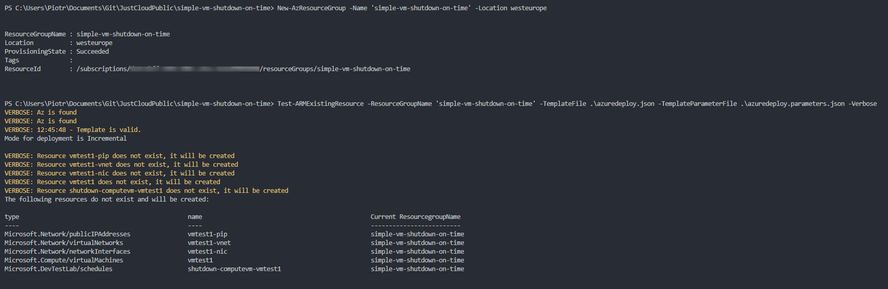
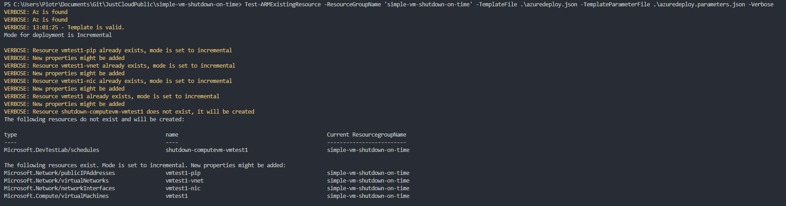
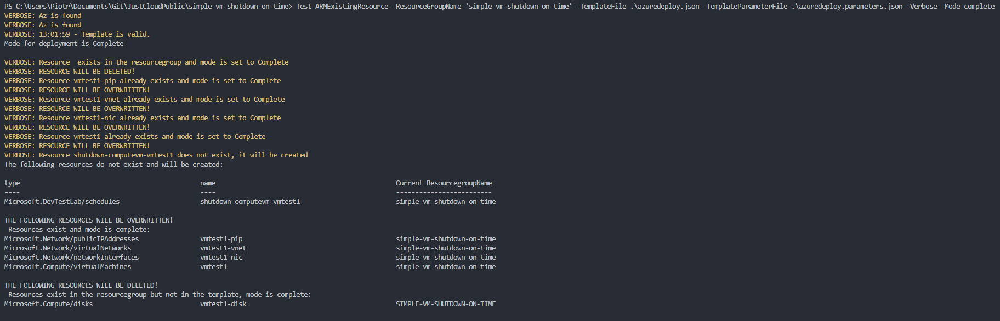

Debug natywnych szablonów ARM jest ciężkim procesem dla wielu osób. Utrzymanie infrastruktury jako kod również nie jest prostą sprawą, dlatego często używa się Terraforma dla wdrożeń w Microsoft Azure.

Szablony ARM nie posiadają pliku stanu jak to jest w Terraform dlatego często spotykam się z opinią, że, ARM'y są beznadziejnie. Po wdrożeniu trudno jest utrzymać stały rozwój infrastruktury z tego samego szablonu oraz często problemem jest przewidywalność co się stanie z obiektami, które już masz. Nie będę się rozwodził co lepsze co gorsze, ponieważ wiele zależy od naszej wiedzy, podejścia, problemu lub zlecenia, które wykonujemy. Jako Inżynier nie przywiązuje się do rozwiązań i uważam, że do każdego problemu należy podchodzić indywidualnie. Moim zdaniem najlepsze rozwiązania to rozwiązania natywne nie wymagające tworzenia koła na nowo. Stąd zachęcam do pisania szablonów ARM dla Azure.

Jako pomoc w tworzeniu infrastruktury jako kod (IaC) w Microsoft Azure polecam zapoznać się z modułem PowerShell: **ARMHelper**

[https://www.powershellgallery.com/packages/ARMHelper/0.6.2](https://www.powershellgallery.com/packages/ARMHelper/0.6.2)

Za pomocą komendy: Test-ARMExistingResource możemy zbudować polecenie, które sprawdzi nam wskazany szablon w kontekście z deploy'owanych zasobów w Azure i wyświetli co się stanie. Przykład poniżej przedstawia stworzoną resource groupe bez zasobów:

Użyłem szablonu z mojego repo: [https://github.com/RogalaPiotr/JustCloudPublic/tree/master/simple-vm-shutdown-on-time](https://github.com/RogalaPiotr/JustCloudPublic/tree/master/simple-vm-shutdown-on-time)  
Wykonuje kolejno komendy:

Tworzenie nowej resource groupy:

New-AzResourceGroup -Name 'simple-vm-shutdown-on-time' -Location westeurope

Sprawdzenie co wyświetli poleniecenie Test-ARMExistingResource:

Test-ARMExistingResource -ResourceGroupName 'simple-vm-shutdown-on-time' -TemplateFile .\\azuredeploy.json -TemplateParameterFile .\\azuredeploy.parameters.json -Verbose

Wynikiem jest informacja co zostanie utworzone. Super sprawa, to teraz zrobie deployment szablonu i sprawdzimy ponownie.

New-AzResourceGroupDeployment -ResourceGroupName 'simple-vm-shutdown-on-time' -TemplateFile .\\azuredeploy.json -TemplateParameterFile .\\azuredeploy.parameters.json -Verbose

Niestety miałem problem z modułem Shutdown i szablon wdrożył się niepoprawnie, dlatego sprawdziłem co wyświetli Test-ARMExistResource.

Test-ARMExistingResource -ResourceGroupName 'simple-vm-shutdown-on-time' -TemplateFile .\\azuredeploy.json -TemplateParameterFile .\\azuredeploy.parameters.json -Verbose

Jak widać polecenie poprawnie zwróciło co jest do poprawienia i co zostanie zmienione(inkrementalnie).

Ostatni test to z argumentem "-Mode Complete" czyli wykonanie szablonu, który dostosuje wszystkie zasoby niezależnie od tego co jest stworzone w resource groupie do mojego szablonu.

Test-ARMExistingResource -ResourceGroupName 'simple-vm-shutdown-on-time' -TemplateFile .\\azuredeploy.json -TemplateParameterFile .\\azuredeploy.parameters.json -Verbose -Mode Complete

Teraz można być pewniejszym co się stanie z wdrożeniem po małych zmianach w szablonie.

  
Mam nadzieje że przyda Ci się ta wiedza :)
