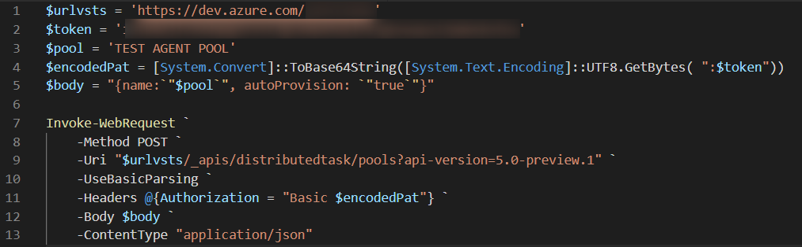
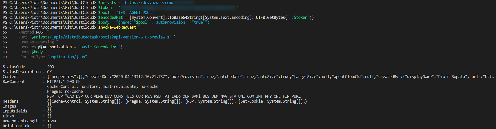
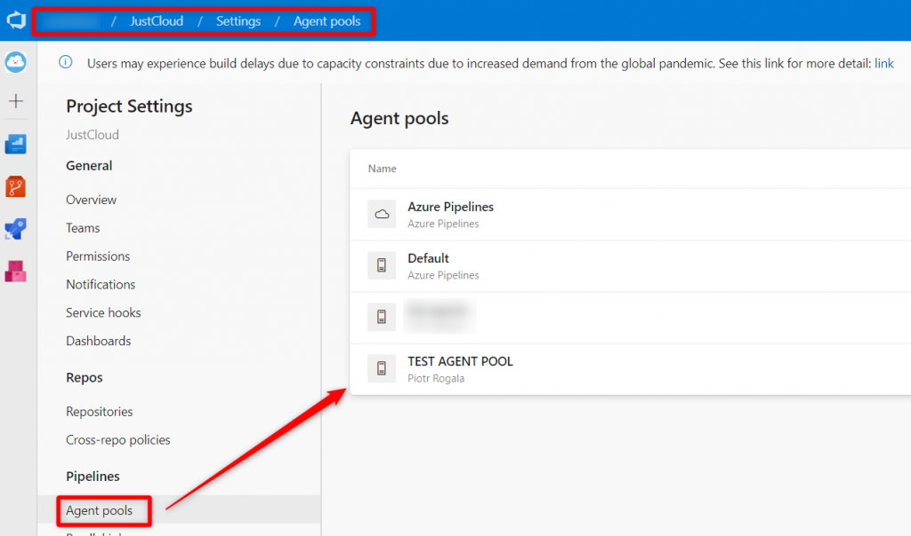

Często stajemy przed wyzwaniem zintegrowania ze sobą wielu narzędzi. Jeżeli stosujemy PowerShell w celu automatyzacji swojej infrastruktury bądź budowy prostych skryptów może nam się przydać zastosowanie użycia wywołania żądania API za pomocą PowerShell. Poniższy przykład zaprezentuje użycie wysłania żądania za pomocą API do Azure DevOps w celu dodania puli agentowej.

Referencje API do Azure DevOps są dostępne tutaj: 

[https://docs.microsoft.com/en-us/rest/api/azure/devops/distributedtask/pools/add?view=azure-devops-rest-5.1](https://docs.microsoft.com/en-us/rest/api/azure/devops/distributedtask/pools/add?view=azure-devops-rest-5.1)

Poniższy przykładowy skrypt możemy rozbudować dla innych operacji stosując odpowiedni uri dla potrzebnej operacji z powyższego linku.  

Na początku definiujemy zmienne:  

- $urlvsts - URL do naszego projektu Azure DevOps
- $token - PAT token (Instrukcja jak wygenerować token: [https://docs.microsoft.com/en-us/azure/devops/organizations/accounts/use-personal-access-tokens-to-authenticate?view=azure-devops&tabs=preview-page](https://docs.microsoft.com/en-us/azure/devops/organizations/accounts/use-personal-access-tokens-to-authenticate?view=azure-devops&tabs=preview-page))
- $pool - nazwa puli, którą chcemy utworzyć
- $encodedPat - przekonwertowanie tokenu na SecureString
- $body - informacje do przekazania w wysyłanym żądaniu

<!--truncate-->

$urlvsts = 'https://dev.azure.com/PROJECT-NAME'
$token = 'YOUR-PAT-TOKEN'
$pool = 'YOUR-POOL-NAME'
$encodedPat = \[System.Convert\]::ToBase64String(\[System.Text.Encoding\]::UTF8.GetBytes( ":$token"))
$body = "{name:\`"$pool\`", autoProvision: \`"true\`"}"

Komenda Invoke-WebRequest wykonuje wysłania żądania podając wcześniej zdefiniowane zmienne oraz zawiera Uri, czyli miejsce, w które zapuka żądanie, aby ustawić nową pulę w Azure DevOps.

Invoke-WebRequest \`
    -Method POST \`
    -Uri "$urlvsts/\_apis/distributedtask/pools?api-version=5.0-preview.1" \`
    -UseBasicParsing \`
    -Headers @{Authorization = "Basic $encodedPat"} \`
    -Body $body \`
    -ContentType "application/json"

Screens:

Code:

Output:

Azure DevOps:

W prosty sposób możemy teraz zautomatyzować operacje w Azure DevOps bez uruchamiania portalu. Niestety referencje API dla Azure DevOps nie pozwalają na wszystko co możemy wyklikać w portalu, ale na pewno pomoże to w osiągnięciu celu. Jeśli masz ciekawe przypadki użycia wspomnianego API lub zastanawiasz się, gdzie można tego użyć zapraszam do komentowania.

Użycie skryptu możecie również sprawdzić w deploymencie puli agentów dla Azure DevOps tutaj: [https://github.com/RogalaPiotr/JustCloudPublic/blob/master/simple-vm-with-installation-vsts-agent/vstsagent.ps1](https://github.com/RogalaPiotr/JustCloudPublic/blob/master/simple-vm-with-installation-vsts-agent/vstsagent.ps1)

Artykuł dostępny również na Medium i LinkedIN:

- (EN) [https://medium.com/@piotr.rogala/api-request-to-azure-devops-from-powershell-2e2f525dbd7a](https://medium.com/@piotr.rogala/api-request-to-azure-devops-from-powershell-2e2f525dbd7a)
- (PL) [https://www.linkedin.com/pulse/wys%C5%82anie-%C5%BC%C4%85dania-api-z-powershell-do-azure-devops-piotr-rogala](https://www.linkedin.com/pulse/wys%C5%82anie-%C5%BC%C4%85dania-api-z-powershell-do-azure-devops-piotr-rogala)
