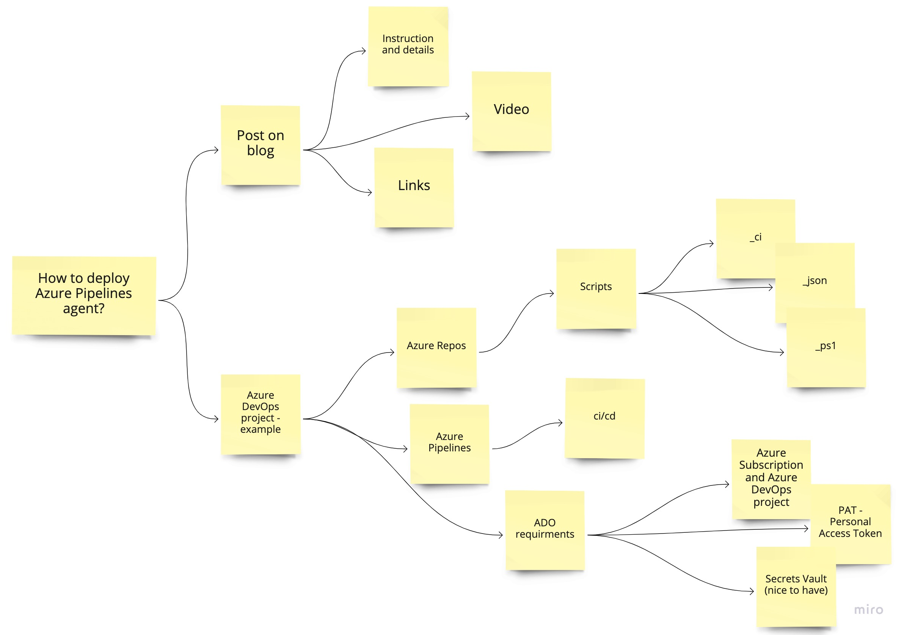
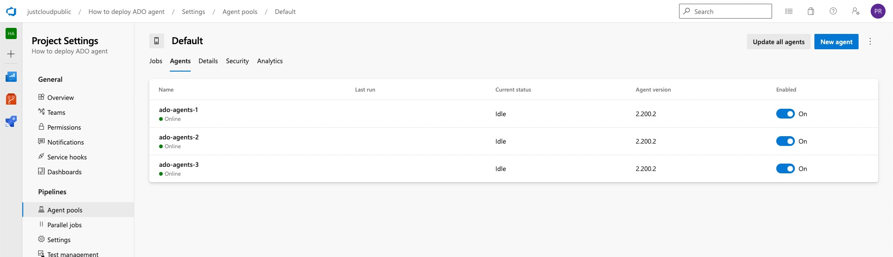
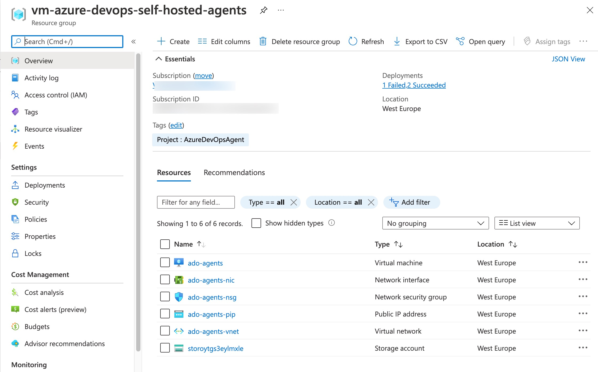

Azure DevOps pozwala na wdrażanie rozwiązań za pośrednictwem agentów tak zwanych ["Microsoft-hosted"](https://docs.microsoft.com/azure/devops/pipelines/agents/agents?view=azure-devops&tabs=browser&WT.mc_id=AZ-MVP-5002690#microsoft-hosted-agents) przez 1800 minut (30 godzin) na miesiąc. W momencie przekroczenia tego czasu nie możemy wykonywać deployment'ów. Jedyna opcja to dokupić unlimited access do agenta za $40 na miesiąc minuty albo korzystać ze swojego serwera, laptopa po zainstalowaniu agenta - ta opcja wdrażania zwana jest w dokumentacji ["Self-Hosted"](https://docs.microsoft.com/azure/devops/pipelines/agents/agents?view=azure-devops&tabs=browser&WT.mc_id=AZ-MVP-5002690#install). Dodam tylko, że wykorzystywanie własnego laptopa do wdrażania nie jest rozwiązaniem produkcyjnym 🙃.

Pricing page Azure DevOps: (https://azure.microsoft.com/pricing/details/devops/azure-devops-services/?WT.mc_id=AZ-MVP-5002690)

Bardzo często słyszę pytanie, a po co mi własny serwer do wdrażania?

[](https://www.youtube.com/watch?v=OO3FANjwKHY)

Klasyczna odpowiedź: to zależy... Robiąc prace dyplomową na uczelnie albo projekt PoC dla znajomego, możecie wybrać opcje postawienia agenta na swoim laptopie. Jeśli pracujecie w grupie paru osób najlepiej byłoby skorzystać z własnego serwera. Jeśli jesteście firmą i dostarczacie rozwiązania to napewno powinniście rozważyć własny serwer lub dokupienie "Microsoft-hosted" za $40 - jeśli czas wdrażania przekracza 1800 minut na miesiąc.
Ale jest jeszcze jedna sytuacja kiedy wybierzecie własny serwer z agentami. Wiele firm korzysta z prywatnych kontrolowanych wewnętrznych sieci z ograniczonym dostępem z zewnątrz. Wdrożenie własnego serwera w waszej sieci pozwoli wam na łatwą komunikacje z wdrożonymi rozwiązaniami na platformie Microsoft Azure, ale zwiększycie też bezpieczeństwo procesowanych danych. Pamiętajmy że agent ["Microsoft-hosted"](https://docs.microsoft.com/azure/devops/pipelines/agents/agents?view=azure-devops&tabs=browser&WT.mc_id=AZ-MVP-5002690#microsoft-hosted-agents) to agent "publiczny" odizolowany od waszej sieci. ["Self-Hosted"](https://docs.microsoft.com/azure/devops/pipelines/agents/agents?view=azure-devops&tabs=browser&WT.mc_id=AZ-MVP-5002690#install) może zostać wdrożony tak samo jako agent odizolowany, ale też możecie go połączyć lub wdrożyć we własnej sieci.

<!--truncate-->

Poniżej odsyłam was do dokumentacji gdzie możecie szczegółowo dowiedzieć się co Microsoft oferuje w kwestii Azure Pipelines agent.

[MS Docs - Azure Pipelines agents](https://docs.microsoft.com/azure/devops/pipelines/agents/agents?view=azure-devops&tabs=browser&WT.mc_id=AZ-MVP-5002690)


Przechodzimy zatem do wdrożenia własnego serwera z agentem.

Przygotowałem ilustracje związaną z całym projektem dla wdrożenia Azure Pipelines agent w oparciu o ten post oraz potrzebne materiały do jego wdrożenia.



1. Linki - za pomocą tych linków macie dostęp do mojego przykładowego wdrożenia

* Azure Repos: (https://dev.azure.com/justcloudpublic/_git/How%20to%20deploy%20ADO%20agent?path=/vm-azure-devops-self-hosted-agents)
* Azure Pipeline: (https://dev.azure.com/justcloudpublic/How%20to%20deploy%20ADO%20agent/_build?definitionId=2)

[](https://dev.azure.com/justcloudpublic/How%20to%20deploy%20ADO%20agent/_build/latest?definitionId=2&branchName=main)

1. Scripts
   1. Parametry
        1. [azuredeploy.param.json](https://dev.azure.com/justcloudpublic/_git/How%20to%20deploy%20ADO%20agent?path=/vm-azure-devops-self-hosted-agents/scripts/azuredeploy.param.json&version=GBmain&_a=contents) - te parametry możesz przerobi lub zmienić tak, aby odpowiadały temu co zostanie wdrożone. Ważne - te dane testów są nadpisywane podczas deployment'u - sprawdź to w pliku: [vm-azure-devops-self-hosted-agents-ci.yml](https://dev.azure.com/justcloudpublic/_git/How%20to%20deploy%20ADO%20agent?path=/vm-azure-devops-self-hosted-agents/pipelines/vm-azure-devops-self-hosted-agents-ci.yml&version=GBmain&_a=contents) "overrideParameters".
           1. Opis zmiennych
              1. adminUsername [User name]
              2. adminPassword [Password for user]
              3. dnsLabelPrefix (default set: generated based on ResourceGroup.Id) [Public DNS for connection RDP]
              4. vmName [VM Name for resource]
              5. AccessIPNSG [IP will be added to NSG rule for RDP access]
              6. tag [default set: "Project: AzureDevOpsAgent"]
              7. DiskForVM [StorageAccount or Managed - choose disk for deployment VM]
            ```
            "parameters": {
                "adminUsername": {
                    "value": "test-user"
                },
                "adminPassword": {
                    "value": "test-P@ssw0rd12345"
                },
                "vmName": {
                    "value": "ado-agents"
                },
                "AccessIPNSG": {
                    "value": "192.168.1.1"
                },
                "tag": {
                    "value": "AzureDevOpsAgent"
                },
                "DiskForVM": {
                    "value": "StorageAccount"
                }
            }
            ```
        2. [createresourcegroup-adoagent.param.json](https://dev.azure.com/justcloudpublic/_git/How%20to%20deploy%20ADO%20agent?path=/vm-azure-devops-self-hosted-agents/scripts/createresourcegroup-adoagent.param.json&version=GBmain&_a=contents) - parametry definiują resource groupę.
           ```
           "parameters": {
               "ResourceGroupLocation": {
                   "value": "westeurope"
               },
               "ResourceGroupName": {
                   "value": "vm-azure-devops-self-hosted-agents"
               },
               "tag": {
                   "value": {
                       "key1": "Project",
                       "value1": "AzureDevOpsAgent"
                   }
               }
           }
            ```
        3. [script-post-configuration.ps1](https://dev.azure.com/justcloudpublic/_git/How%20to%20deploy%20ADO%20agent?path=/vm-azure-devops-self-hosted-agents/scripts/script-post-configuration.ps1&version=GBmain&_a=contents) - skrypt odpowiada za instalację agenta oraz przygotowanie potrzebnych paczek. Jeśli potrzebujesz doinstalować dodatkowe paczki dadaj je w sekcji: # Install Packages - najprościej jest skorzystać z paczek choco: (https://docs.chocolatey.org/en-us/choco/commands/list)
           1. Opis zmiennych
               1. urlProjectADO [URL for your ADO project]
               2. auth (default set: PAT) [Authentication method for your ADO]
               3. token [Security token for your ADO]
               4. pool (default set: default) [Pool name for agent in ADO]
               5. agentname [default is same as VM name]
               6. numberagents [default is 1 - you can deploy from 1 to 20 agent on one server]
               7. instalAddtionalPackages [default is $true and is installing all what is needed for simple deployment to Azure - if you need .NET etc. please add manually]

            ```
            param(
                [Parameter(Mandatory = $true)][string] $urlProjectADO,
                [Parameter(Mandatory = $false)][string] $auth = "pat",
                [Parameter(Mandatory = $true)][string] $token,
                [Parameter(Mandatory = $false)][string] $pool,
                [Parameter(Mandatory = $false)][string] $agentname,
                [Parameter(Mandatory = $false)][ValidateRange(1, 20)][int] $numberagents = 1,
                [Parameter(Mandatory = $false)][bool] $instalAddtionalPackages = $true
            )
            begin {
            }
            process {
                try {
                    if (!(Test-Path "c:\temp")) { $null = mkdir "c:\temp" }
                    $log | % {
                        # Install Additional Packages
                        if ($instalAddtionalPackages) {
                            try {

                                # Install Packages
                                [Net.ServicePointManager]::SecurityProtocol = [Net.SecurityProtocolType]::Tls12
                                Install-PackageProvider -Name "Nuget" -Force
                                # FIX: WARNING: Not setting tab completion: Profile file does not exist at 'C:\Users\USER\Documents\WindowsPowerShell\Microsoft.PowerShellISE_profile.ps1'.
                                if (!(Test-Path -Path $PROFILE)) {
                                    New-Item -ItemType File -Path $PROFILE -Force
                                }
                                Set-ExecutionPolicy Bypass -Scope Process -Force; [System.Net.ServicePointManager]::SecurityProtocol = [System.Net.ServicePointManager]::SecurityProtocol -bor 3072; iex ((New-Object System.Net.WebClient).DownloadString('https://chocolatey.org/install.ps1'))
                                choco feature enable -n allowGlobalConfirmation
                                choco install -y powershell-core
                                Start-Sleep 3
                                choco install -y azure-cli
                                Start-Sleep 3
                                choco install -y az.powershell
                                Start-Sleep 3
                                choco install -y azcopy
                                Start-Sleep 3
                                choco install -y iiscrypto
                                Start-Sleep 3
                                #Install AzureRM in Powershell 5.1
                                C:\Windows\system32\WindowsPowerShell\v1.0\powershell.exe -Command "Install-Module -Name AzureRM -AllowClobber -Force -Confirm:`$false"
                                # END Install Packages

                            }
                            catch {
                                throw $_
                                break
                            }
                        }
                        # Get latest version install agent
                        $getLatestVersion = Invoke-WebRequest https://api.github.com/repos/Microsoft/azure-pipelines-agent/releases/latest -UseBasicParsing
                        $tag = ($getLatestVersion | ConvertFrom-Json)[0].tag_name
                        $tag = $tag.Substring(1)
                        $downloadInstallURL = "https://vstsagentpackage.azureedge.net/agent/$tag/vsts-agent-win-x64-$tag.zip"

                        # Creating Pool in Azure DevOps
                        $encodedPat = [System.Convert]::ToBase64String([System.Text.Encoding]::UTF8.GetBytes( ":$token"))
                        $body = "{name:`"$pool`", autoProvision: `"true`"}"
                        if (!($pool -match "default" -or $pool -match "Azure Pipelines" -or $((Invoke-WebRequest -Method GET -Uri "$urlProjectADO/_apis/distributedtask/pools?api-version=5.1" -UseBasicParsing -Headers @{Authorization = "Basic $encodedPat" }).content | ? { $_ -like "*$pool*" }))) {
                            $tmp = $(Invoke-WebRequest -Method POST -Uri "$urlProjectADO/_apis/distributedtask/pools?api-version=5.0-preview.1" -UseBasicParsing -Headers @{Authorization = "Basic $encodedPat" } -Body $body -ContentType "application/json") 2>$null
                        }

                        # Install agenets
                        $filename = $urlProjectADO.Split('/')[-1]
                        if (!(Test-Path "c:\temp\$filename")) { Invoke-WebRequest -Uri $downloadInstallURL -OutFile "c:\temp\$filename" }

                        for ($i = 1; $i -le $numberagents; $i++) {
                            if (!(Test-Path "c:\agent-$i")) { mkdir "c:\agent-$i" }else { rm c:\agent-$i -recurse -force; mkdir "c:\agent-$i" }
                            Add-Type -AssemblyName System.IO.Compression.FileSystem ; [System.IO.Compression.ZipFile]::ExtractToDirectory("c:\temp\$filename", "c:\agent-$i")
                            ."c:\agent-$i\config.cmd" --unattended --url $urlProjectADO --auth $auth --token $token --pool $pool --agent "$agentname-$i" --runAsService
                        }
                    } | Out-File "c:\temp\ADOagent-$((Get-Date).ToString("s").Replace(":","-")).log"
                    Remove-Item -Recurse -Force c:\temp -Exclude *.log
                }
                catch {
                    throw $_
                    break
                }
                Write-Verbose "Successfully installed Azure DevOps Job Agents"
            }
            ```
    1. Pipelines
       1. [vm-azure-devops-self-hosted-agents-ci.yml](https://dev.azure.com/justcloudpublic/_git/How%20to%20deploy%20ADO%20agent?path=/vm-azure-devops-self-hosted-agents/pipelines/vm-azure-devops-self-hosted-agents-ci.yml&version=GBmain&_a=contents) - w tym pliku zdefiniuj dokładnie dane potrzebne do instalacji agentów - adres Twojego projektu ADO, nazwę pool, ilość agentów. Group oznacza grupę Library w Azure DevOps gdzie przekazujemy bezpiecznie poufne dane.
            ```
            variables:
            - name: SPNName
              value: 'Subscription-JustCloudPublic'
            * name: location
              value: 'westeurope'
            * name: urlProjectADO
              value: 'https://justcloudpublic.visualstudio.com'
            * name: pool
              value: 'Default'
            * name: numberagents
              value: 3
            * group: 'justcloudpublickeyvault'
    2. Requirements - potrzebujesz zanim zaczniesz wdrażać
       1. Azure Subskrypcja
       2. PAT - Personal Access Token - (https://docs.microsoft.com/azure/devops/organizations/accounts/use-personal-access-tokens-to-authenticate?view=azure-devops&tabs=Windows&WT.mc_id=AZ-MVP-5002690#create-a-pat)
       3. Key Vault - (https://docs.microsoft.com/azure/devops/pipelines/release/azure-key-vault?view=azure-devops&WT.mc_id=AZ-MVP-5002690)

Po wdrożeniu:
1. Azure DevOps agents

2. Azure Portal


Jeśli masz jakieś pytania zapraszam do komentowania 🙂.

[](https://www.youtube.com/watch?v=bjtgALglU2o)

Artykuł dostępny również na Medium i LinkedIn:

* (EN) [https://piotr-rogala.medium.com/7223953d2e1f](https://piotr-rogala.medium.com/7223953d2e1f)
* (PL) [https://www.linkedin.com/pulse/jak-wdro%25C5%25BCy%25C4%2587-azure-pipelines-agenta-piotr-rogala/](https://www.linkedin.com/pulse/jak-wdro%25C5%25BCy%25C4%2587-azure-pipelines-agenta-piotr-rogala/)
