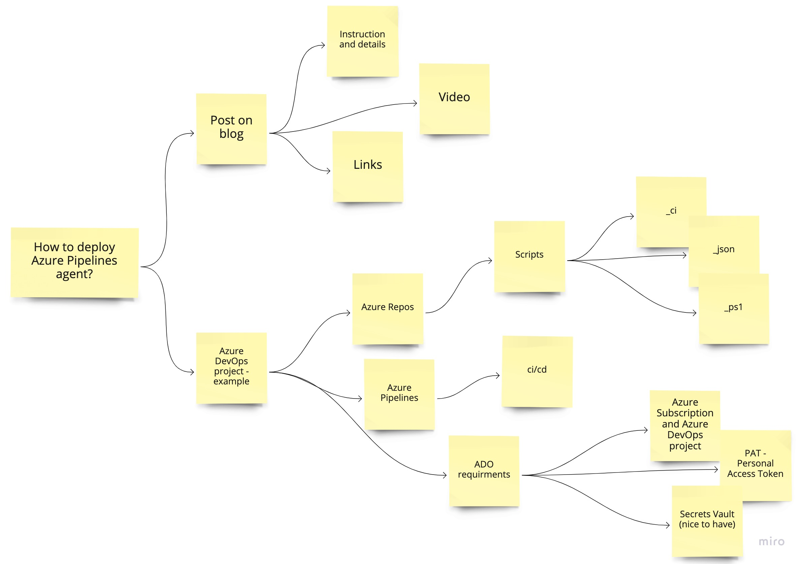
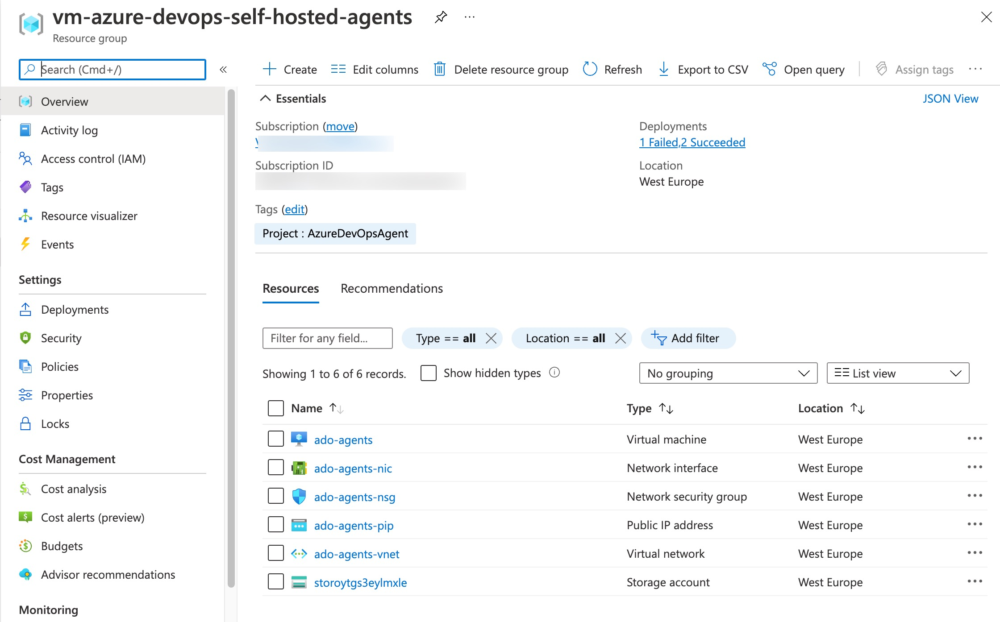

---
authors:
  - progala
date: "2022-01-31"
description: Praktyczny przewodnik - jak wdrożyć własnego Azure Pipelines agenta na serwerze lub VM krok po kroku, ze skryptami, konfiguracją i wskazówkami bezpieczeństwa.
keywords:
    - Azure DevOps
    - Azure
    - agent
    - pipelines
    - self-hosted
    - deployment
    - wdrożenie
    - automatyzacja
    - skrypty
    - bezpieczeństwo
slug: how to deploy azure pipelines agent
tags:
  - deploy
  - Azure
  - DevOps
  - agent
  - pipelines
title: Jak wdrożyć Azure Pipeline agenta?
---

import ReactPlayer from 'react-player'

Azure DevOps pozwala na wdrażanie rozwiązań za pośrednictwem agentów tzw. ["Microsoft-hosted"](https://docs.microsoft.com/azure/devops/pipelines/agents/agents?view=azure-devops&tabs=browser&WT.mc_id=AZ-MVP-5002690#microsoft-hosted-agents) przez 1800 minut (30 godzin) miesięcznie. Po przekroczeniu tego czasu nie możemy wykonywać deploymentów.

Można jednak dokupić nielimitowany dostęp do agenta za $40 miesięcznie lub korzystać ze swojego serwera, np. laptopa, instalując agenta — ta opcja wdrażania jest znana w dokumentacji jako ["Self-Hosted"](https://docs.microsoft.com/azure/devops/pipelines/agents/agents?view=azure-devops&tabs=browser&WT.mc_id=AZ-MVP-5002690#install). Dodam tylko, że wykorzystywanie własnego laptopa do wdrażania nie jest rozwiązaniem produkcyjnym 🙃.

Strona z cenami Azure DevOps: (https://azure.microsoft.com/pricing/details/devops/azure-devops-services/?WT.mc_id=AZ-MVP-5002690)

Bardzo często słyszę pytanie: po co mi własny serwer do wdrażania?

<ReactPlayer
  controls
  src='https://www.youtube.com/watch?v=OO3FANjwKHY'
  width='65%'
  height='auto'
  style={{ display: 'block', margin: '0 auto 20px auto', aspectRatio: '16/9' }}
/>
<!-- truncate -->

Klasyczna odpowiedź: to zależy... Przy pracy nad pracą dyplomową lub projektem PoC dla znajomego można postawić agenta na swoim laptopie. Jeśli pracujecie w grupie kilku osób, najlepiej byłoby skorzystać z własnego serwera. Jeśli jesteście firmą dostarczającą rozwiązania, zdecydowanie warto rozważyć własny serwer lub zakup agentów "Microsoft-hosted" za $40, jeśli czas wdrażania przekracza 1800 minut miesięcznie. Jest jeszcze jedna sytuacja, kiedy warto wybrać własny serwer z agentami: wiele firm korzysta z prywatnych, kontrolowanych wewnętrznych sieci z ograniczonym dostępem z zewnątrz. Wdrożenie własnego serwera w takiej sieci pozwoli na łatwą komunikację z wdrożonymi rozwiązaniami na platformie Microsoft Azure oraz zwiększy bezpieczeństwo procesowanych danych. Pamiętajmy, że agent ["Microsoft-hosted"](https://docs.microsoft.com/azure/devops/pipelines/agents/agents?view=azure-devops&tabs=browser&WT.mc_id=AZ-MVP-5002690#microsoft-hosted-agents) to agent "publiczny", odizolowany od waszej sieci. ["Self-Hosted"](https://docs.microsoft.com/azure/devops/pipelines/agents/agents?view=azure-devops&tabs=browser&WT.mc_id=AZ-MVP-5002690#install) może zostać wdrożony jako agent odizolowany, ale można go również zintegrować z własną siecią.

Poniżej odsyłam was do dokumentacji, w której można dowiedzieć się więcej o możliwościach oferowanych przez Microsoft w zakresie agentów Azure Pipelines.

[MS Docs - Azure Pipelines agents](https://docs.microsoft.com/azure/devops/pipelines/agents/agents?view=azure-devops&tabs=browser&WT.mc_id=AZ-MVP-5002690)


Przechodzimy zatem do wdrożenia własnego serwera z agentem.

Przygotowałem ilustracje związane z całym projektem dla wdrożenia Azure Pipelines agent w oparciu o ten post oraz potrzebne materiały do jego wdrożenia.



1. Linki - za pomocą tych linków macie dostęp do mojego przykładowego wdrożenia
   1. Azure Repos: (https://dev.azure.com/justcloudpublic/_git/How%20to%20deploy%20ADO%20agent?path=/vm-azure-devops-self-hosted-agents)
   2. Azure Pipeline: (https://dev.azure.com/justcloudpublic/How%20to%20deploy%20ADO%20agent/_build?definitionId=2)

[](https://dev.azure.com/justcloudpublic/How%20to%20deploy%20ADO%20agent/_build/latest?definitionId=2&branchName=main)

2. Skrypty
   1. Parametry
   2. [azuredeploy.param.json](https://dev.azure.com/justcloudpublic/_git/How%20to%20deploy%20ADO%20agent?path=/vm-azure-devops-self-hosted-agents/scripts/azuredeploy.param.json&version=GBmain&_a=contents) - te parametry możesz przerobić lub zmienić tak, aby odpowiadały potrzebom wdrożenia. Ważne: te dane testowe są nadpisywane podczas deploymentu — sprawdź to w pliku: [vm-azure-devops-self-hosted-agents-ci.yml](https://dev.azure.com/justcloudpublic/_git/How%20to%20deploy%20ADO%20agent?path=/vm-azure-devops-self-hosted-agents/pipelines/vm-azure-devops-self-hosted-agents-ci.yml&version=GBmain&_a=contents) "overrideParameters".

3. Opis zmiennych
   1. adminUsername [nazwa użytkownika]
   2. adminPassword [hasło użytkownika]
   3. dnsLabelPrefix (domyślnie ustawiany: generowany na podstawie ResourceGroup.Id) [publiczny DNS do połączenia RDP]
   4. vmName [nazwa maszyny wirtualnej]
   5.  AccessIPNSG [IP, które zostanie dodane do reguły NSG dla dostępu RDP]
   6.  tag [domyślnie ustawiony: "Project: AzureDevOpsAgent"]
   7.  DiskForVM [StorageAccount lub Managed - wybór dysku dla wdrożenia maszyny wirtualnej]

```json
"parameters": {
    "adminUsername": {
        "value": "test-user"
    },
    "adminPassword": {
        "value": "test-P@ssw0rd12345"
    },
    "vmName": {
        "value": "ado-agents"
    },
    "AccessIPNSG": {
        "value": "192.168.1.1"
    },
    "tag": {
        "value": "AzureDevOpsAgent"
    },
    "DiskForVM": {
        "value": "StorageAccount"
    }
}

```

4. [createresourcegroup-adoagent.param.json](https://dev.azure.com/justcloudpublic/_git/How%20to%20deploy%20ADO%20agent?path=/vm-azure-devops-self-hosted-agents/scripts/createresourcegroup-adoagent.param.json&version=GBmain&_a=contents) - parametry definiujące grupę zasobów.

```json
"parameters": {
    "ResourceGroupLocation": {
        "value": "westeurope"
    },
    "ResourceGroupName": {
        "value": "vm-azure-devops-self-hosted-agents"
    },
    "tag": {
        "value": {
            "key1": "Project",
            "value1": "AzureDevOpsAgent"
        }
    }
}

```

5. [script-post-configuration.ps1](https://dev.azure.com/justcloudpublic/_git/How%20to%20deploy%20ADO%20agent?path=/vm-azure-devops-self-hosted-agents/scripts/script-post-configuration.ps1&version=GBmain&_a=contents) - skrypt odpowiada za instalację agenta oraz przygotowanie potrzebnych paczek. Jeśli potrzebujesz doinstalować dodatkowe paczki, dodaj je w sekcji: # Install Packages - najprościej jest skorzystać z paczek choco: (https://docs.chocolatey.org/en-us/choco/commands/list)

6. Opis zmiennych

   1. urlProjectADO [URL do projektu ADO]
   2. auth (domyślnie ustawione: PAT) [metoda uwierzytelniania dla projektu ADO]
   3. token [token bezpieczeństwa dla projektu ADO]
   4. pool (domyślnie ustawione: default) [nazwa puli dla agenta w ADO]
   5. agentname [domyślnie taka sama jak nazwa maszyny wirtualnej]
   6. numberagents [domyślnie 1 - można wdrożyć od 1 do 20 agentów na jednym serwerze]
   7. instalAddtionalPackages [domyślnie $true; instaluje wszystko, co potrzebne do prostego wdrożenia w Azure; jeśli potrzeba .NET itp., należy dodać ręcznie]

```powershell
param(
    [Parameter(Mandatory = $true)][string] $urlProjectADO,
    [Parameter(Mandatory = $false)][string] $auth = "pat",
    [Parameter(Mandatory = $true)][string] $token,
    [Parameter(Mandatory = $false)][string] $pool,
    [Parameter(Mandatory = $false)][string] $agentname,
    [Parameter(Mandatory = $false)][ValidateRange(1, 20)][int] $numberagents = 1,
    [Parameter(Mandatory = $false)][bool] $instalAddtionalPackages = $true
)
begin {
}
process {
    try {
        if (!(Test-Path "c:\temp")) { $null = mkdir "c:\temp" }
        $log | % {
            # Install Additional Packages
            if ($instalAddtionalPackages) {
                try {

                    # Install Packages
                    [Net.ServicePointManager]::SecurityProtocol = [Net.SecurityProtocolType]::Tls12
                    Install-PackageProvider -Name "Nuget" -Force
                    # FIX: WARNING: Not setting tab completion: Profile file does not exist at 'C:\Users\USER\Documents\WindowsPowerShell\Microsoft.PowerShellISE_profile.ps1'.
                    if (!(Test-Path -Path $PROFILE)) {
                        New-Item -ItemType File -Path $PROFILE -Force
                    }
                    Set-ExecutionPolicy Bypass -Scope Process -Force; [System.Net.ServicePointManager]::SecurityProtocol = [System.Net.ServicePointManager]::SecurityProtocol -bor 3072; iex ((New-Object System.Net.WebClient).DownloadString('https://chocolatey.org/install.ps1'))
                    choco feature enable -n allowGlobalConfirmation
                    choco install -y powershell-core
                    Start-Sleep 3
                    choco install -y azure-cli
                    Start-Sleep 3
                    choco install -y az.powershell
                    Start-Sleep 3
                    choco install -y azcopy
                    Start-Sleep 3
                    choco install -y iiscrypto
                    Start-Sleep 3
                    #Install AzureRM in Powershell 5.1
                    C:\Windows\system32\WindowsPowerShell\v1.0\powershell.exe -Command "Install-Module -Name AzureRM -AllowClobber -Force -Confirm:`$false"
                    # END Install Packages

                }
                catch {
                    throw $_
                    break
                }
            }
            # Get latest version install agent
            $getLatestVersion = Invoke-WebRequest https://api.github.com/repos/Microsoft/azure-pipelines-agent/releases/latest -UseBasicParsing
            $tag = ($getLatestVersion | ConvertFrom-Json)[0].tag_name
            $tag = $tag.Substring(1)
            $downloadInstallURL = "https://vstsagentpackage.azureedge.net/agent/$tag/vsts-agent-win-x64-$tag.zip"

            # Creating Pool in Azure DevOps
            $encodedPat = [System.Convert]::ToBase64String([System.Text.Encoding]::UTF8.GetBytes( ":$token"))
            $body = "{name:`"$pool`", autoProvision: `"true`"}"
            if (!($pool -match "default" -or $pool -match "Azure Pipelines" -or $((Invoke-WebRequest -Method GET -Uri "$urlProjectADO/_apis/distributedtask/pools?api-version=5.1" -UseBasicParsing -Headers @{Authorization = "Basic $encodedPat" }).content | ? { $_ -like "*$pool*" }))) {
                $tmp = $(Invoke-WebRequest -Method POST -Uri "$urlProjectADO/_apis/distributedtask/pools?api-version=5.0-preview.1" -UseBasicParsing -Headers @{Authorization = "Basic $encodedPat" } -Body $body -ContentType "application/json") 2>$null
            }

            # Install agents
            $filename = $urlProjectADO.Split('/')[-1]
            if (!(Test-Path "c:\temp\$filename")) { Invoke-WebRequest -Uri $downloadInstallURL -OutFile "c:\temp\$filename" }

            for ($i = 1; $i -le $numberagents; $i++) {
                if (!(Test-Path "c:\agent-$i")) { mkdir "c:\agent-$i" }else { rm c:\agent-$i -recurse -force; mkdir "c:\agent-$i" }
                Add-Type -AssemblyName System.IO.Compression.FileSystem ; [System.IO.Compression.ZipFile]::ExtractToDirectory("c:\temp\$filename", "c:\agent-$i")
                ."c:\agent-$i\config.cmd" --unattended --url $urlProjectADO --auth $auth --token $token --pool $pool --agent "$agentname-$i" --runAsService
            }
        } | Out-File "c:\temp\ADOagent-$((Get-Date).ToString("s").Replace(":","-")).log"
        Remove-Item -Recurse -Force c:\temp -Exclude *.log
    }
    catch {
        throw $_
        break
    }
    Write-Verbose "Successfully installed Azure DevOps Job Agents"
}

```

7. Pipelines
   1. [vm-azure-devops-self-hosted-agents-ci.yml](https://dev.azure.com/justcloudpublic/_git/How%20to%20deploy%20ADO%20agent?path=/vm-azure-devops-self-hosted-agents/pipelines/vm-azure-devops-self-hosted-agents-ci.yml&version=GBmain&_a=contents) - w tym pliku zdefiniuj dokładnie dane potrzebne do instalacji agentów — adres Twojego projektu ADO, nazwę puli oraz liczbę agentów. Grupa oznacza grupę Library w Azure DevOps, w której bezpiecznie przekazujemy poufne dane.

```yaml
variables:
- name: SPNName
  value: 'Subscription-JustCloudPublic'
- name: location
    value: 'westeurope'
- name: urlProjectADO
    value: 'https://justcloudpublic.visualstudio.com'
- name: pool
    value: 'Default'
- name: numberagents
    value: 3
- group: 'justcloudpublickeyvault'

```

8. Wymagania - co potrzebujesz wiedzieć, zanim zaczniesz wdrażać:

   1. Subskrypcja Azure
   2. PAT — Personal Access Token — (https://docs.microsoft.com/azure/devops/organizations/accounts/use-personal-access-tokens-to-authenticate?view=azure-devops&tabs=Windows&WT.mc_id=AZ-MVP-5002690#create-a-pat)
   3. Key Vault — (https://docs.microsoft.com/azure/devops/pipelines/release/azure-key-vault?view=azure-devops&WT.mc_id=AZ-MVP-5002690)

Po wdrożeniu:

   1. Azure DevOps agents
      
   2. Azure Portal
      

## Instruktaż video

<ReactPlayer
  controls
  src='https://www.youtube.com/watch?v=bjtgALglU2o'
  width='65%'
  height='auto'
  style={{ display: 'block', margin: '0 auto 20px auto', aspectRatio: '16/9' }}
/>

Jeśli masz jakieś pytania, zapraszam do komentowania 🙂.

Artykuł dostępny również na Medium i LinkedIn:

- (EN) [https://piotr-rogala.medium.com/7223953d2e1f](https://piotr-rogala.medium.com/7223953d2e1f)
- (PL) [https://www.linkedin.com/pulse/jak-wdro%25C5%25BCy%25C4%2587-azure-pipelines-agenta-piotr-rogala/](https://www.linkedin.com/pulse/jak-wdro%25C5%25BCy%25C4%2587-azure-pipelines-agenta-piotr-rogala/)
