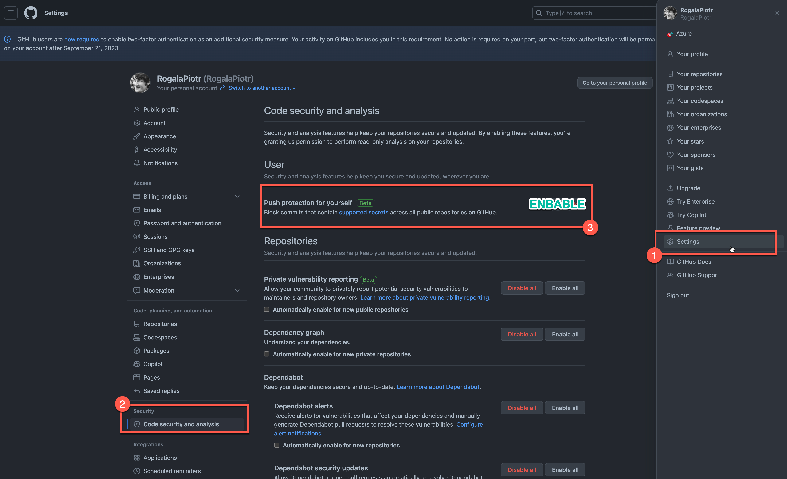
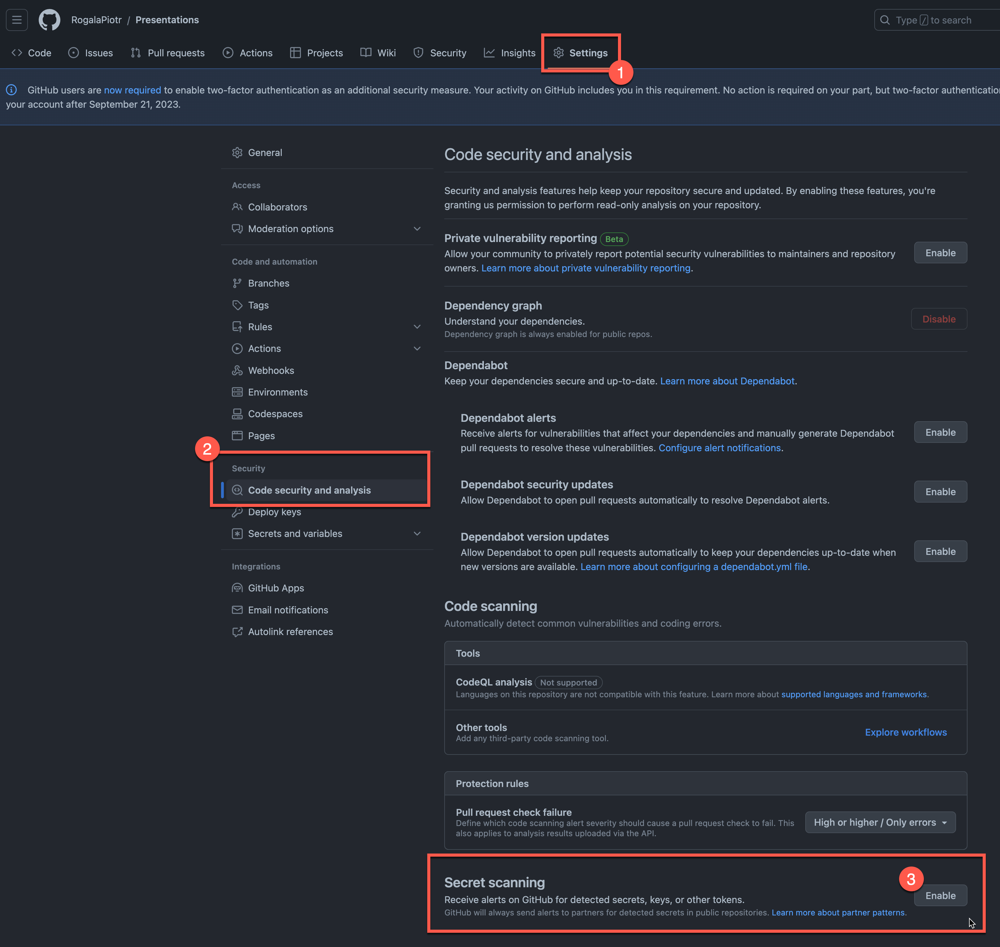

GitHub jako popularna platforma zarządzania kodem stale wprowadza nowe funkcje, aby zapewnić bezpieczne środowisko dla repozytoriów w organizacji i projektach prywatnych. Jednym z ulepszeń jest funkcja "Push protection for repositories and organizations" (Ochrona przed przesyłaniem do repozytoriów i organizacji), która przynosi wielu korzyści dla Programistów i Cloud Inżynierom czy DevOps-om. W tym artykule omówimy, jak ta nowa funkcja wpływa na Twoje repozytorium na GitHubie i w jaki sposób możesz skorzystać z jej zalet.

Czym jest "**Push protection for repositories and organizations**"?

"Push protection for repositories and organizations" to funkcja, która zapewnia ochronę przed nieautoryzowanymi zmianami w Twoim repozytorium na GitHubie. Działa na poziomie organizacji, chroniąc wszystkie repozytoria w niej zawarte, jak również można ją skonfigurować na poziomie indywidualnego repozytorium. Funkcja ta rozpoznaje potencjalnie wrażliwe dane, takie jak klucze API, hasła czy tokeny dostępowe, które są niezamierzenie przesyłane do repozytoriów.

Co ta funkcja zmienia w Twoim repozytorium?

<!--truncate-->

1. Wykrywanie i blokowanie przesyłania poufnych danych: Dzięki tej funkcji GitHub będzie automatycznie wykrywał poufne dane w wysyłanych plikach, w tym hasła, klucze API czy tokeny dostępowe. Przesyłanie takich danych do repozytorium jest częstym błędem i może prowadzić do naruszenia bezpieczeństwa. "Push protection for repositories and organizations" skutecznie zablokuje takie próby przesyłania, zapobiegając potencjalnym zagrożeniom.
2. Powiadamianie o potencjalnych naruszeniach: W przypadku wykrycia próby przesyłania poufnych danych, GitHub przekaże informacje o tym naruszeniu do właściciela repozytorium lub odpowiedniego zespołu bezpieczeństwa. To pomaga w wczesnym wykrywaniu i reagowaniu na potencjalne zagrożenia.
3. Personalizacja ochrony na różnych poziomach: Dzięki "Push protection for repositories and organizations" możesz dostosować ochronę na indywidualnym poziomie repozytorium oraz na poziomie organizacji. Możesz zdecydować, czy chcesz włączyć niestandardowe reguły dla swoich repozytoriów i jakie typy wrażliwych danych chcesz zablokować. To daje pełną kontrolę nad zapewnieniem bezpieczeństwa dla Twoich projektów.

Jak skorzystać z "**Push protection for repositories and organizations**"?

Aby skorzystać z funkcji "Push protection for repositories and organizations" dla swojego profilu na GitHubie, wystarczy dokonać kilku kroków:

1. Przejdź do Settings swojego profilu na GitHubie.
2. Wybierz zakładkę "Code security and analysis".
3. W sekcji "Push protection for yourself" wybierz "Enable" 

<aside>

**💡 Dodatkowo można to skonfigurować w podobny sposób dla całej organizacji.**
</aside>

Natomiast jesli chcesz to skonfigurowa na poziomie repozyotrium wykonaj te kroki:

Przejdź do ustawień swojego repozytorium na GitHubie.
Wybierz zakładkę "Security" (Bezpieczeństwo).
W sekcji "Push protection" (Ochrona przed przesyłaniem) skonfiguruj preferowane ustawienia ochrony.
Możesz zdecydować, które typy wrażliwych danych chcesz zablokować oraz czy chcesz włączyć powiadomienia o naruszeniach dla właściciela repozytorium lub odpowiedniego zespołu bezpieczeństwa.
Zapisz zmiany.

Link do pełnej dokumentacji: 
* (https://docs.github.com/en/enterprise-cloud@latest/code-security/secret-scanning/push-protection-for-repositories-and-organizations)

Jeśli masz jakieś pytania zapraszam do komentowania 🙂.