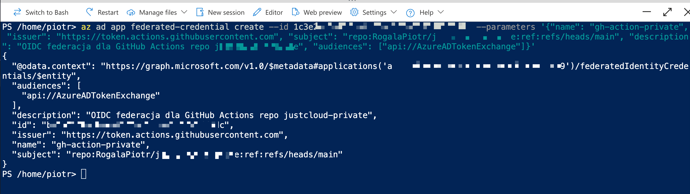
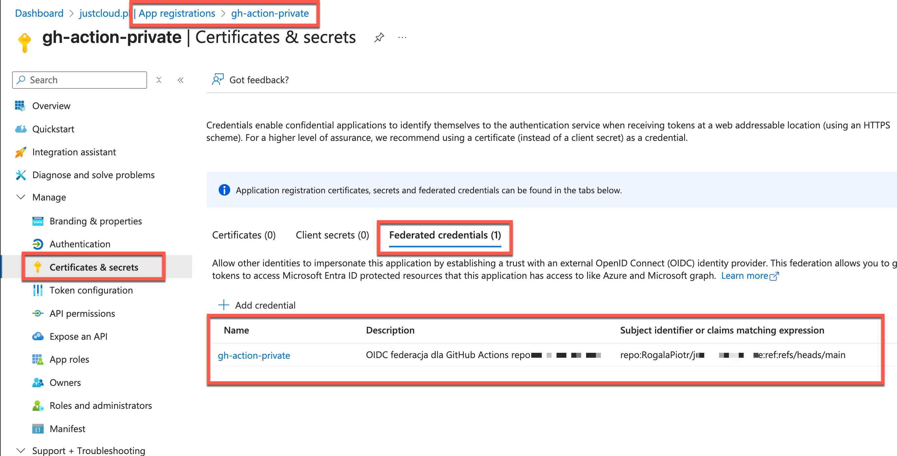
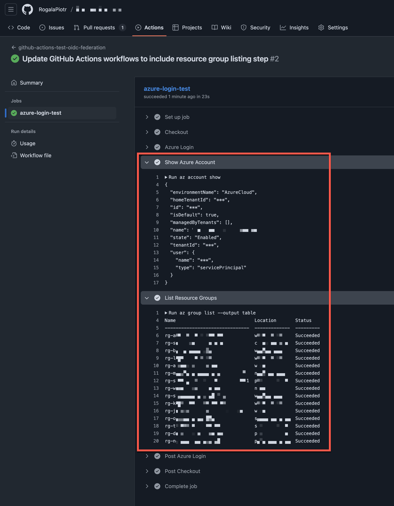

---
authors:
  - progala
comments: true
date: "2025-11-20"
description: "Poradnik krok po kroku: Jak skonfigurować bezpieczne połączenie GitHub Actions z Azure używając OIDC i Azure CLI. Pozbądź się haseł i kluczy!"
keywords:
  - azure
  - github actions
  - oidc
  - workload identity federation
  - azure cli
  - devops
  - security
  - ci/cd
tags:
  - azure
  - github-actions
  - devops
  - security
  - tutorial
title: "Bezpieczne wdrażanie do Azure z GitHub Actions: Konfiguracja OIDC"
---

Chcesz skonfigurować bezpieczny dostęp do Microsoft Azure z poziomu GitHub Actions dla wdrożeń infrastruktury i aplikacji? Jeśli tak, to ten przewodnik jest dla Ciebie. Pokażę Ci, jak to zrobić krok po kroku, wykorzystując Azure CLI.

## Dlaczego OIDC?

Dlaczego to rozwiązanie jest bezpieczniejsze od tradycyjnego Service Principal z kluczem (secret)? Ponieważ **nie tworzymy konta z hasłem**, które trzeba rotować i chronić przed wyciekiem.

Mechanizm ten działa na zasadzie **Workload Identity Federation**. Polega on na powiązaniu obiektu Service Principal w Azure z konkretnym repozytorium GitHub. Dzięki protokołowi OIDC (OpenID Connect), GitHub wymienia swój token tożsamości na krótko żyjący token dostępu do Azure.

Więcej o tym mechanizmie przeczytasz w [dokumentacji Microsoft](https://learn.microsoft.com/entra/workload-id/workload-identity-federation-create-trust?WT.mc_id=AZ-MVP-5002690).

## Wymagania

Do wykonania poniższych kroków będziesz potrzebować Azure CLI.
* **Co to jest Azure CLI?**: [Wprowadzenie](https://learn.microsoft.com/cli/azure/what-is-azure-cli?view=azure-cli-latest&WT.mc_id=AZ-MVP-5002690)
* **Instalacja**: [Instrukcja instalacji](https://learn.microsoft.com/cli/azure/install-azure-cli?view=azure-cli-latest&WT.mc_id=AZ-MVP-5002690)

## Konfiguracja krok po kroku

Po zalogowaniu się do Azure (`az login`), wykonaj poniższe polecenia w terminalu. Dla wygody możesz też użyć Cloud Shell dostępnego w Azure Portal.

### 1. Tworzenie aplikacji i Service Principal

Najpierw utworzymy App Registration oraz Service Principal.

```bash
# Tworzymy App Registration i pobieramy appId
az ad app create --display-name "gh-action-private" --query "appId" -o tsv

# UWAGA: Skopiuj wyświetlony appId. Będzie on używany w kolejnych komendach jako [appId].

# Tworzymy Service Principal dla aplikacji
az ad sp create --id [appId]
```

Pierwsza komenda utworzy nowy obiekt **App Registration** w Microsoft Entra ID.


<!-- truncate -->

Druga komenda utworzy obiekt **Enterprise Application** (Service Principal) o tej samej nazwie.


### 2. Nadawanie uprawnień

Po utworzeniu tożsamości, musimy nadać jej uprawnienia do subskrypcji. W tym przykładzie użyjemy roli **Contributor**.

> **Dobra praktyka:** Jestem zwolennikiem nadawania najniższych możliwych uprawnień (Least Privilege). Jednak dla ogólnych wdrożeń infrastruktury, rola Contributor na poziomie subskrypcji jest często niezbędnym minimum.

```bash
# Podmień [appId] na ID z poprzedniego kroku oraz wpisz swoje ID subskrypcji
az role assignment create --assignee [appId] --role Contributor --scope /subscriptions/[TWOJE_SUBSCRIPTION_ID]
```

Nadane uprawnienia możesz sprawdzić w portalu Azure, wchodząc w Subskrypcję -> IAM -> Role Assignments.


### 3. Konfiguracja federacji (OIDC)

Teraz najważniejszy krok – powiązanie aplikacji Azure z repozytorium GitHub.

```bash
# Podmień [appId] oraz [NAZWA_TWOJEGO_REPO] (format: Użytkownik/Repozytorium)
az ad app federated-credential create --id [appId] --parameters '{"name": "gh-action-private", "issuer": "https://token.actions.githubusercontent.com", "subject": "repo:RogalaPiotr/[NAZWA_TWOJEGO_REPO]:ref:refs/heads/main", "description": "OIDC federacja dla GitHub Actions repo [NAZWA_TWOJEGO_REPO]", "audiences": ["api://AzureADTokenExchange"]}'
```



W sekcji App Registration możesz zweryfikować poprawność utworzonej federacji:



### 4. Pobranie danych App Registration

Aby skonfigurować GitHub Actions, potrzebujemy trzech wartości: `Client ID`, `Tenant ID` oraz `Subscription ID`.

```bash
# Pobierz Client ID (Application ID) - jeśli zgubiłeś
az ad app show --id [appId] --query "appId" -o tsv

# Pobierz Tenant ID
az account show --query tenantId -o tsv

# Subscription ID masz już z kroku 2.
```

### 5. Konfiguracja GitHub

Przejdź teraz do swojego repozytorium na GitHub. Wejdź w **Settings** -> **Secrets and variables** -> **Actions** i dodaj następujące sekrety (Repository secrets):

*   `AZURE_CLIENT_ID` – Twój Application ID
*   `AZURE_TENANT_ID` – Twój Tenant ID
*   `AZURE_SUBSCRIPTION_ID` – ID subskrypcji, do której nadałeś uprawnienia (w naszym przypadku Contributor)


### 6. Testowy Pipeline

Jeśli wszystko jest skonfigurowane, możemy utworzyć testowy workflow, aby sprawdzić połączenie.

Utwórz plik `.github/workflows/github-actions-test-oidc-federation.yml`:

```yaml
name: 'github-actions-test-oidc-federation'

on:
  pull_request:
    paths:
      - '.github/workflows/github-actions-test-oidc-federation.yml'
  push:
    branches:
      - main
    paths:
      - '.github/workflows/github-actions-test-oidc-federation.yml'
  workflow_dispatch:

permissions:
  id-token: write # Wymagane do działania OIDC!
  contents: read

jobs:
  azure-login-test:
    runs-on: ubuntu-latest
    steps:
      - name: Checkout
        uses: actions/checkout@v4

      - name: Azure Login
        uses: azure/login@v2
        with:
          client-id: ${{ secrets.AZURE_CLIENT_ID }}
          tenant-id: ${{ secrets.AZURE_TENANT_ID }}
          subscription-id: ${{ secrets.AZURE_SUBSCRIPTION_ID }}

      - name: Show Azure Account
        run: az account show

      - name: List Resource Groups
        run: az group list --output table
```

Jeśli pipeline zakończy się sukcesem, zobaczysz listę grup zasobów w logach.



Jeśli pipeline nie działa, upewnij się, że:
1.  Sekrety w GitHub są poprawne.
2.  Rola na subskrypcji została poprawnie nadana.
3.  Subject w federacji (`repo:Użytkownik/Repo:ref:refs/heads/main`) dokładnie odpowiada Twojemu repozytorium i gałęzi.

## Przydatne linki

*   **Azure:** [Configure a federated identity credential](https://learn.microsoft.com/entra/workload-id/workload-identity-federation-create-trust?WT.mc_id=AZ-MVP-5002690)
*   **GitHub:** [OIDC for Actions](https://docs.github.com/en/actions/concepts/security/openid-connect)
*   **GitHub Action:** [Azure Login](https://github.com/marketplace/actions/azure-login)
*   **RBAC:** [Built-in roles (Contributor)](https://learn.microsoft.com/azure/role-based-access-control/built-in-roles/privileged?WT.mc_id=AZ-MVP-5002690#contributor)

Jeśli interesuje Cię wdrożenie konkretnych usług lub masz pytania, daj znać w komentarzu!
