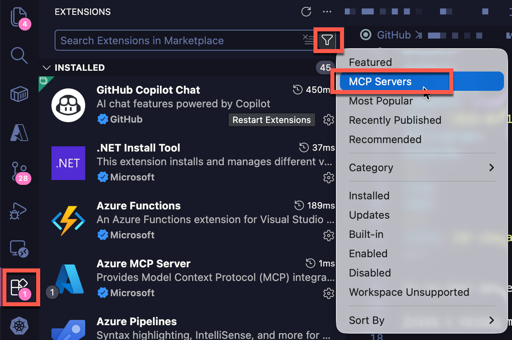
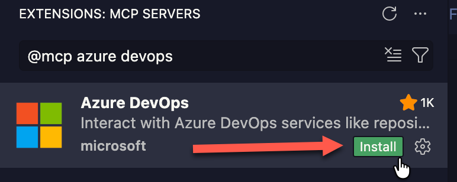
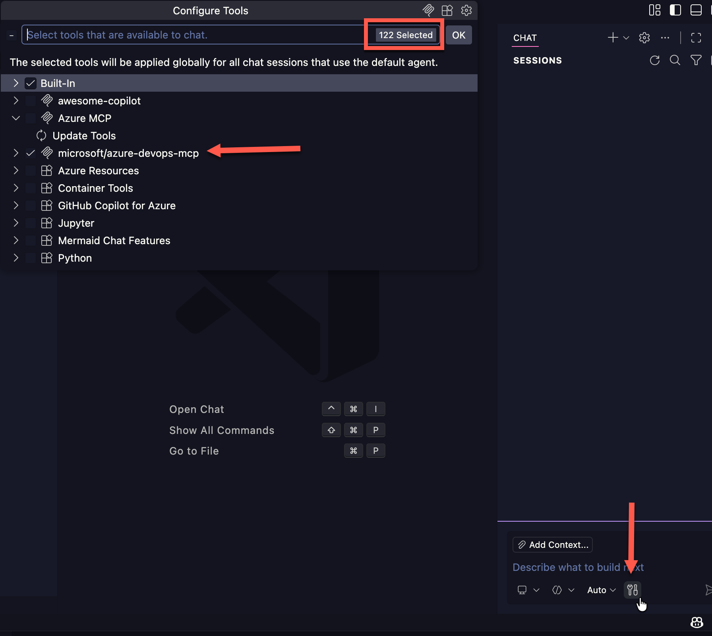
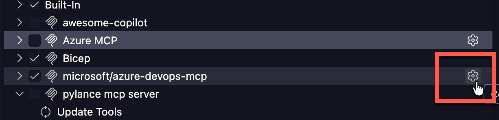
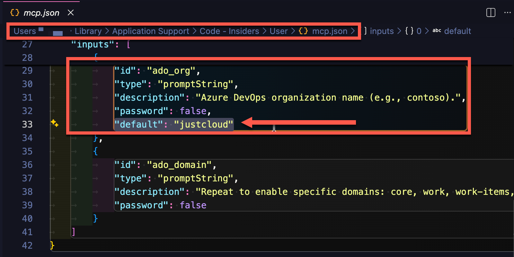
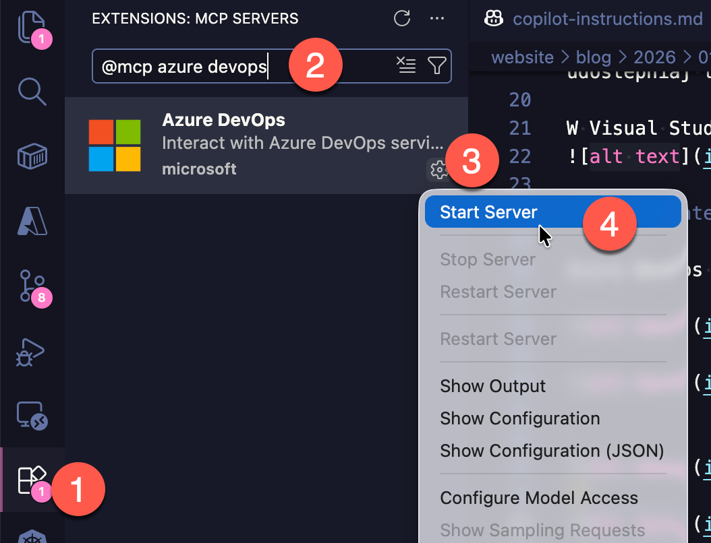
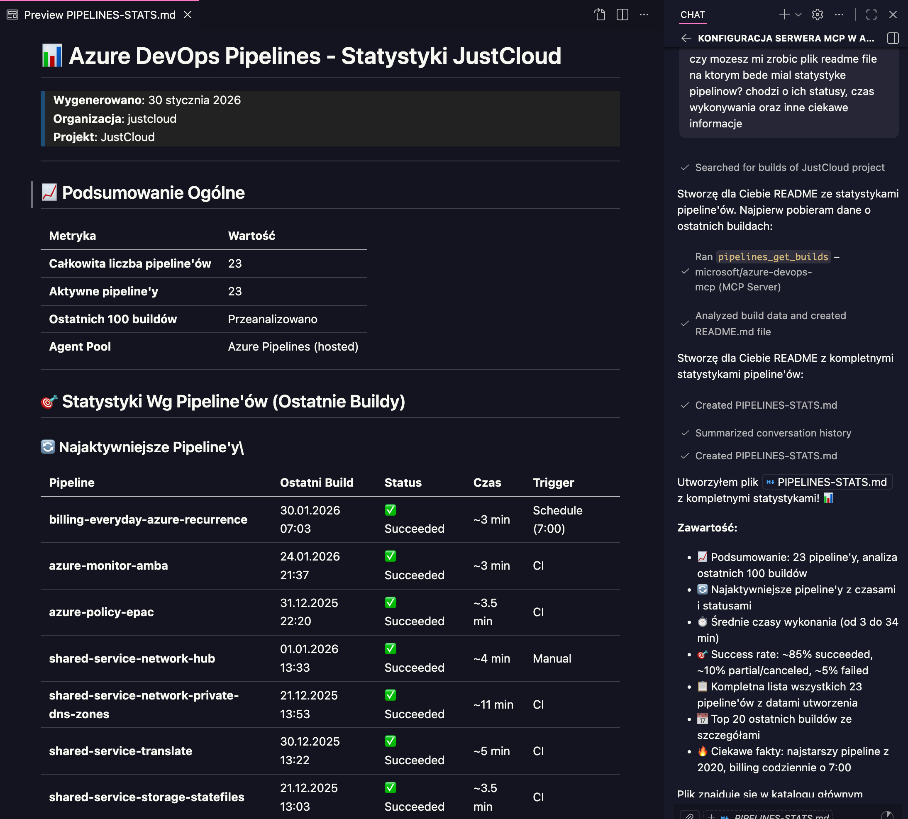

---
authors:
  - progala
comments: true
date: "2026-01-19"
description: "Podłącz Azure DevOps do Copilota z MCP. Instalacja w 5 krokach, uwierzytelnianie i automatyzacja zadań DevOps. Gotowe przykłady i lista możliwości." 
keywords:
  - mcp
  - mcp server
  - azure devops
  - azure devops mcp
  - vs code
  - copilot
  - devops
  - work items
  - pipelines
  - pull requests
  - security
slug: mcp-server-azure-devops-vscode
tags:
  - azure-devops
  - mcp
  - vscode
  - copilot
  - devops
  - security
  - ai
  
title: "Azure DevOps MCP Server w VS Code instalacja i automatyzacja w 5 krokach"
---

Chcesz bezpiecznie podłączyć Azure DevOps do Copilota przez MCP? Poniżej masz krótką, konkretną instrukcję i listę możliwości serwera.

> **Ważna uwaga:** używaj wyłącznie zaufanych serwerów MCP. To bezpośredni dostęp do Twoich zasobów, więc nie podawaj danych logowania, jeśli nie masz pewności co do źródła.

Serwery MCP znajdziesz na: https://mcpservers.org

Visual Studio Code ma natywną obsługę serwerów MCP – możesz je wyszukiwać i instalować bezpośrednio z wbudowanego Marketplace rozszerzeń, filtrując wyniki po słowie kluczowym "MCP".

<!-- truncate -->

## Wymagania
- Visual Studio Code
- Azure DevOps (organizacja + konto z dostępem)
- Wtyczka: https://github.com/microsoft/azure-devops-mcp

## Instalacja i konfiguracja (krok po kroku)

### 1. Zainstaluj wtyczkę MCP dla Azure DevOps
Wyszukaj "Azure DevOps" i zainstaluj wtyczkę w VS Code.

### 2. Włącz serwer MCP w Copilocie
Kliknij ustawienia pod oknem prompta i włącz narzędzie microsoft/azure-devops-mcp, czyli MCP dla ADO. Na screenie zaznaczyłem liczbę uruchomionych narzędzi, ponieważ ostatnio miałem tam limit 128 (https://github.com/microsoft/vscode-copilot-release/issues/13065). Gdybyś miał ten sam problem, musisz odznacyć inne narzędzia.

### 3. Skonfiguruj organizację w pliku `mcp.json`
Wejdź ponownie w wybieranie narzędzi, kliknij koło zębate i w pliku mcp.json dodaj w ustawieniach serwera wpis `default = "NAZWA_ORGANIZACJI_AZURE_DEVOPS"` z nazwą Twojej organizacji Azure DevOps.

### 4. Uruchom serwer MCP
Kliknij prawym przyciskiem myszy na serwer i wybierz **Start**.

### 5. Zaloguj się do Azure DevOps
W przeglądarce pojawi się okno logowania. Po autoryzacji serwer jest gotowy do użycia.

## Przykładowe zastosowanie
W kilka sekund możesz wygenerować raport o repozytoriach i pipeline’ach, pobierać dane o work items, PR-ach i buildach albo automatyzować pracę zespołu.

## Najważniejsze możliwości serwera

### 📋 Projekty i organizacja
- listowanie projektów
- listowanie zespołów w projekcie
- pobieranie ID tożsamości użytkowników

### 👥 Work items
- tworzenie, pobieranie i aktualizacja work items
- linkowanie i usuwanie linków
- komentarze i rewizje
- praca z iteracjami i zapytaniami

### 🔄 Iteracje i planowanie
- listowanie i tworzenie iteracji
- przypisywanie iteracji do zespołów
- aktualizacja capacity zespołu

### 🔨 Pipelines i buildy
- listowanie definicji buildów
- pobieranie buildów i logów
- uruchamianie pipeline’ów i runów
- aktualizacja etapów

### 📦 Repozytoria (Git)
- listowanie repozytoriów i branchy
- tworzenie branchy
- wyszukiwanie commitów

### 🔀 Pull requests
- tworzenie i aktualizacja PR-ów
- dodawanie reviewerów
- komentarze i wątki
- linkowanie work items do PR

### 📖 Wiki
- pobieranie i aktualizacja stron

### 🧪 Test plans
- test plans, suites i cases
- dodawanie test cases do suites

### 🔍 Wyszukiwanie
- search w kodzie, wiki i work items

### 🔐 Advanced Security
- alerty bezpieczeństwa i lista alertów

## Przydatne linki
- MCP servers: https://mcpservers.org
- Azure DevOps MCP (repo): https://github.com/microsoft/azure-devops-mcp

Mam nadzieję, że teraz wszystko jest jasne. Daj znać, czy się przydało! 💪
