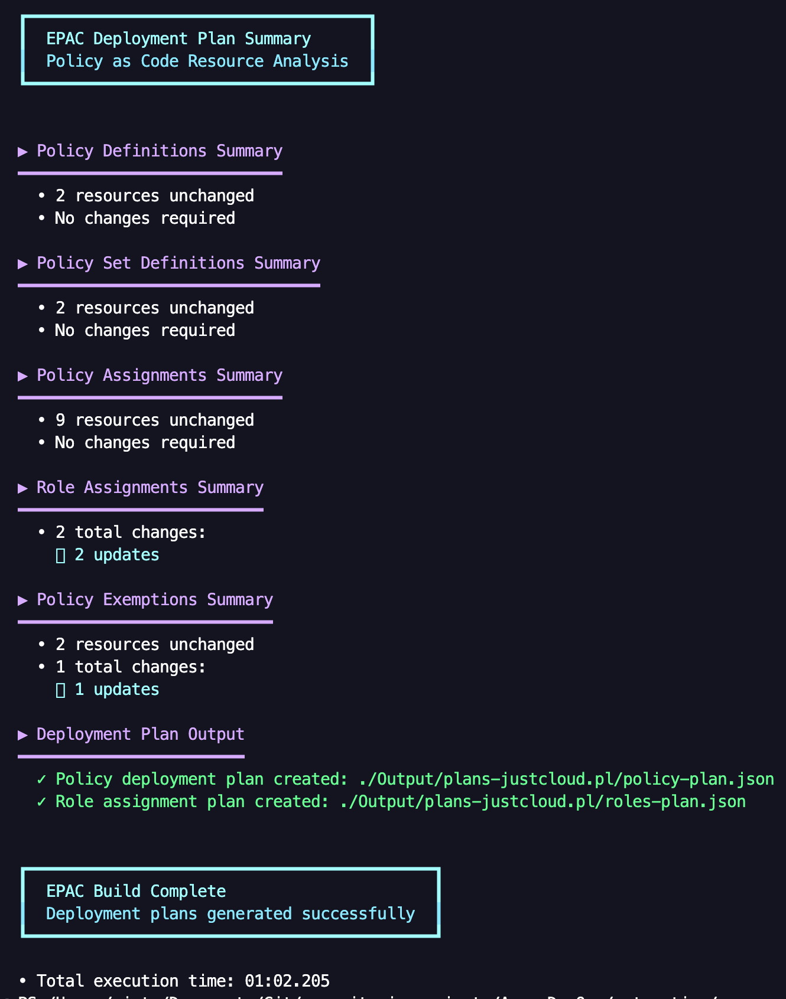
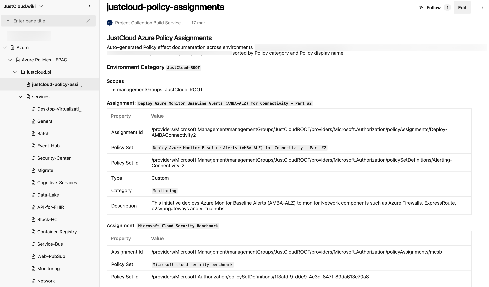

---
authors:
  - progala
comments: true
date: "2026-02-24"
description: "Jak zacząć z EPAC w Azure. Eksport polityk, build planu, deploy i dokumentacja na gotowych komendach PowerShell."
keywords:
  - EPAC
  - Enterprise Policy as Code
  - Azure Policy
  - Azure governance
  - Azure Management Groups
  - PowerShell
  - policy as code
  - Azure Policy assignments
  - Azure Policy initiatives
slug: epac-intro
tags:
  - Azure
  - Azure Policy
  - governance
  - PowerShell
  - IaC
title: "Automatyzacja Azure Policy z EPAC — jak zacząć?"
---

Zarządzasz większą liczbą Azure Policy i przypisań na poziomie Management Groups? Portal Azure szybko robi się niewygodny, a trzymanie wszystkiego w dużych plikach Terraform też nie zawsze kończy się czytelną strukturą. EPAC rozwiązuje ten problem podejściem **Policy as Code**.

Poniżej pokażę Ci, czym jest **Enterprise Policy as Code**, jak zrobić eksport obecnego środowiska i jak używać najważniejszych komend do lokalnych testów oraz wdrożeń.

## Co to jest EPAC

**Enterprise Policy as Code (EPAC)** to moduł PowerShell do zarządzania:

- definicjami polityk
- inicjatywami Policy Set
- przypisaniami polityk
- wykluczeniami i dokumentacją
- wymaganymi rolami RBAC dla polityk typu `DeployIfNotExists`

Najważniejsze jest to, że EPAC działa w modelu **desired state**. Repozytorium staje się źródłem prawdy, a narzędzie potrafi porównać konfigurację z rzeczywistym stanem środowiska i przygotować plan zmian.

> **Ważna uwaga:** przed pierwszym wdrożeniem zrób eksport istniejących polityk. To najprostsza droga, jeśli Twoje środowisko było dotąd konfigurowane ręcznie w portalu.

<!-- truncate -->

## Kiedy EPAC ma sens

EPAC szczególnie dobrze sprawdza się, gdy:

- zarządzasz politykami w wielu subskrypcjach i Management Groups
- chcesz mieć przegląd zmian przed wdrożeniem
- potrzebujesz spójnego procesu CI/CD dla governance
- chcesz generować dokumentację polityk na podstawie konfiguracji
- chcesz ograniczyć i wyeliminować ręczne zmiany w portalu Azure

## Instalacja EPAC

Paczka dostępna w [PowerShell Gallery](https://www.powershellgallery.com/packages/EnterprisePolicyAsCode).

```powershell
Install-Module -Name EnterprisePolicyAsCode
```

## Plik konfiguracyjny środowiska

Aby rozpocząć pracę, istotny jest plik `global-settings.jsonc` w folderze `Definitions`. To główny plik konfiguracji EPAC. Jeśli zaczynasz i chcesz zrobić tylko eksport, ten plik również musi zostać utworzony.

Struktura pliku:

```jsonc
{
    "$schema": "https://raw.githubusercontent.com/Azure/enterprise-azure-policy-as-code/main/Schemas/global-settings-schema.json",
    "pacOwnerId": "YOUR-GENERATED-ID", // unikalne ID instancji EPAC – zalecane jest użycie GUID
    "pacEnvironments": [
        {
            "pacSelector": "YOUR-NAME-ORG",
            "cloud": "AzureCloud",
            "tenantId": "YOUR-TENANT-ID",
            "deploymentRootScope": "SCOPE-FOR-DEPLOYMENT-SCAN-BY-EPAC--MANAGEMENT-GROUP-ID",
            "desiredState": {
                "strategy": "ownedOnly", // full lub ownedOnly
                "keepDfcSecurityAssignments": false,
                "doNotDisableDeprecatedPolicies": false
            },
            "skipResourceValidationForExemptions": false,
            "managedIdentityLocation": "westeurope" // region dla MSI
        }
    ]
}
```

> **Ważne:** parametr `strategy` przyjmuje dwie wartości:
> - `full` — EPAC zarządza **wszystkimi** politykami w podanym zakresie; wszystko, czego nie ma w konfiguracji, zostanie usunięte.
> - `ownedOnly` — EPAC wdraża tylko to, co jest w konfiguracji; istniejące przypisania spoza EPAC pozostają niezmienione.

## Jak wygląda lokalny workflow

Poniżej masz prosty zestaw komend, którego używam do lokalnego testowania EPAC:

```powershell
$definitions = "./Definitions"
$output = "./Output"
$docs = "./Output/Documentation"
$pac = "YOUR-NAME"

# 1. Build - generowanie planów wdrożenia
Build-DeploymentPlans -DefinitionsRootFolder $definitions -OutputFolder $output -PacEnvironmentSelector $pac

# 2. Deploy - wdrożenie polityk
Deploy-PolicyPlan -DefinitionsRootFolder $definitions -InputFolder $output -PacEnvironmentSelector $pac

# 3. Deploy - wdrożenie ról RBAC
Deploy-RolesPlan -DefinitionsRootFolder $definitions -InputFolder $output -PacEnvironmentSelector $pac

# 4. Documentation - generowanie dokumentacji
Build-PolicyDocumentation -DefinitionsRootFolder $definitions -OutputFolder $docs -pacSelector $pac
```



## Jak zrobić eksport istniejących polityk

Jeśli zaczynasz pracę z EPAC w środowisku, które już działa, zacznij od eksportu. Dzięki temu nie tworzysz wszystkiego od zera, tylko mapujesz aktualny stan Azure do struktury EPAC.

```powershell
$definitions = "./Definitions"
$output = "./Output"

$exportParams = @{
    DefinitionsRootFolder = $definitions
    OutputFolder          = $output
    Interactive           = $false
    IncludeChildScopes    = $true
    FileExtension         = "jsonc"
    Mode                  = "Export"
}

Export-AzPolicyResources @exportParams
```

Ta komenda:

- skanuje polityki i przypisania w środowisku
- generuje pliki w strukturze EPAC
- daje Ci punkt startowy do dalszego porządkowania repozytorium

## Generowanie dokumentacji

EPAC potrafi też wygenerować dokumentację na podstawie konfiguracji w formacie markdown.

```powershell
$definitions = "./Definitions"
$docs = "./Output/Documentation"
$pac = "YOUR-NAME"

Build-PolicyDocumentation `
  -DefinitionsRootFolder $definitions `
  -OutputFolder $docs `
  -pacSelector $pac
```

To przydaje się, jeśli chcesz mieć czytelny opis polityk dla zespołu platformowego, bezpieczeństwa albo audytu.



## Przydatne linki

- [Enterprise Azure Policy as Code documentation](https://azure.github.io/enterprise-azure-policy-as-code/)
- [Azure enterprise azure policy as code na GitHub](https://github.com/Azure/enterprise-azure-policy-as-code)
- [Azure Policy documentation](https://learn.microsoft.com/azure/governance/policy/overview?WT.mc_id=AZ-MVP-5002690)
- [Azure Management Groups documentation](https://learn.microsoft.com/azure/governance/management-groups/overview?WT.mc_id=AZ-MVP-5002690)
- [AzAdvertizer](https://www.azadvertizer.net/)

Jeśli interesuje Cię wdrożenie EPAC w Azure Landing Zones albo integracja z GitHub Actions czy Azure DevOps, daj znać w komentarzu! 💪
